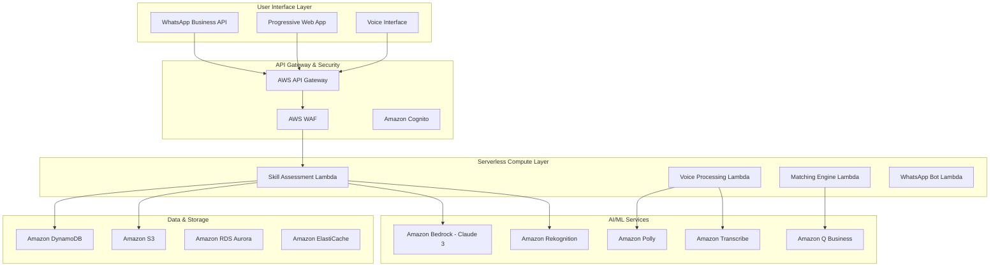

# SheBalance - AI-Powered Artisan-as-a-Service Platform
## Technical Design & Architecture Document

## Executive Summary
SheBalance leverages cutting-edge AI and serverless cloud architecture to transform India's informal artisan economy into a verified, scalable marketplace. Our technical design centers on a "Snap → Score → Earn" methodology powered by computer vision, natural language processing, and intelligent matching algorithms, all delivered through a WhatsApp-first, voice-native experience.

## Technical Architecture Overview

### Serverless-First Cloud Architecture
**Why Serverless**: Enables rapid scaling from 1,000 to 1,000,000 users without infrastructure management, reduces operational costs by 60%, and provides automatic high availability across multiple regions.



### Core Technology Stack

#### Frontend Layer
- **Progressive Web App (PWA)**: React.js with TypeScript for type safety and maintainability
- **WhatsApp Integration**: WhatsApp Business API with webhook processing
- **Voice Interface**: Web Speech API with fallback to cloud-based speech services
- **Offline Capability**: Service workers for core functionality during network interruptions
- **Performance**: Lighthouse score >90, Core Web Vitals optimization

#### Backend Services (Serverless)
- **API Gateway**: AWS API Gateway with custom authorizers and rate limiting
- **Compute**: AWS Lambda functions with Node.js runtime for consistent JavaScript ecosystem
- **Authentication**: Amazon Cognito with social login and multi-factor authentication
- **Security**: AWS WAF with custom rules for DDoS protection and bot mitigation

#### AI/ML Infrastructure
- **Foundation Models**: Amazon Bedrock with Claude 3 Sonnet for conversational AI
- **Computer Vision**: Amazon Rekognition Custom Labels for craft skill assessment
- **Speech Processing**: Amazon Polly (text-to-speech) and Transcribe (speech-to-text)
- **Business Intelligence**: Amazon Q for intelligent query processing and insights

# SheBalance - AI-Powered Artisan-as-a-Service Platform
## Technical Design & Architecture Document

## Executive Summary
SheBalance leverages cutting-edge AI and serverless cloud architecture to transform India's informal artisan economy into a verified, scalable marketplace. Our technical design centers on a "Snap → Score → Earn" methodology powered by computer vision, natural language processing, and intelligent matching algorithms, all delivered through a WhatsApp-first, voice-native experience.

## Technical Architecture Overview

### Serverless-First Cloud Architecture
**Why Serverless**: Enables rapid scaling from 1,000 to 1,000,000 users without infrastructure management, reduces operational costs by 60%, and provides automatic high availability across multiple regions.


### Core Technology Stack

#### Frontend Layer
- **Progressive Web App (PWA)**: React.js with TypeScript for type safety and maintainability
- **WhatsApp Integration**: WhatsApp Business API with webhook processing
- **Voice Interface**: Web Speech API with fallback to cloud-based speech services
- **Offline Capability**: Service workers for core functionality during network interruptions
- **Performance**: Lighthouse score >90, Core Web Vitals optimization

#### Backend Services (Serverless)
- **API Gateway**: AWS API Gateway with custom authorizers and rate limiting
- **Compute**: AWS Lambda functions with Node.js runtime for consistent JavaScript ecosystem
- **Authentication**: Amazon Cognito with social login and multi-factor authentication
- **Security**: AWS WAF with custom rules for DDoS protection and bot mitigation

#### AI/ML Infrastructure
- **Foundation Models**: Amazon Bedrock with Claude 3 Sonnet for conversational AI
- **Computer Vision**: Amazon Rekognition Custom Labels for craft skill assessment
- **Speech Processing**: Amazon Polly (text-to-speech) and Transcribe (speech-to-text)
- **Business Intelligence**: Amazon Q for intelligent query processing and insights

## Layout & Structure System

### Responsive Grid System
A flexible, mobile-first grid system that adapts to all screen sizes:

- **Desktop (1024px+)**: 12-column grid with 24px gutters, max-width 1200px
- **Tablet (768px-1024px)**: 8-column grid with 20px gutters, full-width with padding
- **Mobile (320px-768px)**: 4-column grid with 16px gutters, full-width with padding
- **Container Padding**: 20px (mobile), 32px (tablet), 40px (desktop)

### Spacing System
Consistent spacing scale based on 8px units for visual harmony:

- **Base Unit**: 8px
- **Scale**: 4px, 8px, 12px, 16px, 20px, 24px, 32px, 40px, 48px, 64px, 80px, 96px
- **Usage**: All margins, padding, and gaps use the spacing scale
- **Vertical Rhythm**: Line-height and spacing maintain consistent vertical rhythm

### Component Architecture

#### 1. Navigation System
**Sidebar Navigation**: The primary navigation system with intelligent design

- **Desktop**: Fixed left sidebar, 280px width, collapsible to 60px
- **Tablet**: Overlay sidebar with backdrop, 280px width
- **Mobile**: Full-screen overlay navigation with smooth transitions
- **Visual Design**: White background, subtle shadow, rounded active states
- **Active State**: Burnt orange gradient with white text and rounded corners
- **Icons**: 20px with 8px margin-right, consistent spacing

#### 2. Card System
**Unified Card Design Language**: Consistent card components across the platform

- **Base Card**: White background, 12px border-radius, subtle shadow
- **Padding**: 24px for content areas, 16px for compact cards
- **Shadow**: 0 4px 6px rgba(0, 0, 0, 0.1) with hover enhancement
- **Hover Effects**: Subtle lift with increased shadow and 2px transform
- **Variants**: Standard, compact, featured, and interactive cards

#### 3. Button System
**Comprehensive Button Hierarchy**: Clear visual hierarchy for actions

- **Primary**: Burnt orange gradient, white text, 8px border-radius
- **Secondary**: White background, burnt orange border and text
- **Outline**: Transparent background, colored border and text
- **Ghost**: Transparent background, colored text only
- **Sizes**: Small (32px), Medium (40px), Large (48px), Extra-large (56px)
- **States**: Default, hover, active, disabled, loading

#### 4. Form Elements
**Accessible Form Design**: User-friendly input components

- **Input Fields**: White background, light gray border, 8px border-radius
- **Focus State**: Burnt orange border with subtle glow effect
- **Labels**: Medium weight, 14px, positioned above inputs with proper spacing
- **Validation**: Color-coded borders and helper text with icons
- **Accessibility**: Proper ARIA labels and keyboard navigation support

## Page-Specific Design Architecture

### Landing Page Design
**Hero-Driven Experience**: Compelling first impression with clear value proposition

- **Hero Section**: Two-column layout with powerful headline and interactive carousel
- **Headline**: "Reclaim Her Time, Ignite Her Career" in Playfair Display serif
- **Carousel**: 6-slide professional artisan showcase with smooth transitions
- **Statistics**: Key impact metrics with animated counters
- **Features**: Reality gap comparison with visual before/after presentation
- **Process**: Step-by-step journey visualization with icons and descriptions
- **Testimonials**: Success stories with metrics and authentic user photos
- **CTA**: Prominent "Join SheBalance" button with compelling copy

### Dashboard Design
**Information-Rich Command Center**: Comprehensive overview with actionable insights

- **Header Bar**: User greeting, language toggle, voice command, notifications, profile
- **Balance Cards**: Four-column grid showing daily balance metrics with progress bars
- **Statistics Grid**: Key performance indicators with trend arrows and growth metrics
- **Content Grid**: Two-column layout for focus items and opportunities
- **Quick Actions**: Prominent buttons for common tasks and workflows
- **Progress Indicators**: Visual representation of goals and achievements

### Skills Page Design
**Portfolio-Centric Layout**: Showcase skills with AI-powered assessment

- **SkillScan AI**: Prominent feature with drag-and-drop upload interface
- **Skills Portfolio**: Grid layout with skill cards showing proficiency levels
- **AI Chatbot**: Floating chat interface with smooth animations
- **Course Catalog**: Detailed course cards with pricing and EMI options
- **Learning Paths**: Personalized recommendations with visual roadmaps
- **Certification**: Achievement badges and skill verification display

### Progress Page Design
**Analytics Dashboard**: Comprehensive progress visualization and goal tracking

- **Overview Cards**: Key metrics with large numbers and trend indicators
- **Main Chart**: Interactive Chart.js visualization with time period controls
- **Breakdown Charts**: Pie charts for income and time distribution
- **Achievement Timeline**: Vertical timeline with milestone markers
- **Goal Tracking**: Progress bars with target indicators and completion status

## Advanced UI Components

### SkillScan AI Interface
**Revolutionary Skill Assessment Experience**: Intuitive photo-based evaluation

**Upload Interface**:
- Drag-and-drop zone with visual feedback and file validation
- Multi-file support (up to 5 images, 10MB each)
- Progress indicators during upload and processing
- Error handling with clear messaging and retry options

**Category Selection**:
- Visual grid with skill icons and descriptions
- Single-select interaction with clear visual feedback
- Skill-specific guidance and examples
- Accessibility support with keyboard navigation

**Analysis Interface**:
- Real-time progress indicator with estimated completion time
- Animated loading states with engaging micro-interactions
- Processing status updates with clear communication
- Error recovery with helpful suggestions

**Results Display**:
- Comprehensive dashboard with overall score and detailed breakdown
- Animated score reveal with circular progress indicators
- Detailed feedback with strengths and improvement areas
- Action buttons for certification, portfolio addition, and sharing

### AI Chatbot Interface
**Conversational AI Experience**: Natural and helpful interaction design

**Chat Interface**:
- Clean message bubbles with proper spacing and typography
- User and bot message differentiation with avatars and colors
- Typing indicators and message status feedback
- Smooth scrolling and auto-scroll to new messages

**Suggestion System**:
- Quick action buttons for common queries
- Contextual suggestions based on user profile and history
- Visual categorization of suggestion types
- Easy-to-tap interface elements for mobile users

**Response Formatting**:
- Rich text support with formatting and emphasis
- Structured responses with lists and sections
- Embedded links and call-to-action buttons
- Code snippets and technical content formatting

### Voice Interface Design
**Hands-Free Interaction**: Accessible voice command system

**Voice Activation**:
- Prominent microphone button with clear visual states
- Animated voice waves during listening and processing
- Status indicators for different voice command states
- Error handling with clear audio and visual feedback

**Voice Feedback**:
- Audio confirmation for successful commands
- Visual feedback for voice recognition accuracy
- Error messages with suggested corrections
- Multi-language support with proper pronunciation

### Translation Interface
**Seamless Language Switching**: Effortless bilingual experience

**Language Toggle**:
- Clear language indicator with flag and text
- Smooth transition animations without layout shift
- Instant content replacement with proper loading states
- Preference persistence across sessions

**Content Adaptation**:
- Proper text direction and alignment for different languages
- Cultural adaptation of colors, imagery, and messaging
- Number and currency formatting for regional preferences
- Date and time format localization

## Responsive Design System

### Breakpoint Strategy
**Mobile-First Approach**: Progressive enhancement for optimal performance

- **Mobile**: 320px - 768px (Primary focus - 60% of users)
- **Tablet**: 768px - 1024px (Secondary - 25% of users)  
- **Desktop**: 1024px+ (Tertiary - 15% of users)
- **Large Desktop**: 1440px+ (Enhanced experience)

### Mobile Adaptations
**Touch-First Experience**: Optimized for mobile interaction

- **Navigation**: Collapsible hamburger menu with full-screen overlay
- **Cards**: Single column layout with full width and proper spacing
- **Typography**: Optimized sizing (14px minimum) for mobile readability
- **Touch Targets**: Minimum 44px for all interactive elements
- **Gestures**: Swipe support for carousels and navigation
- **Performance**: Optimized images and lazy loading for mobile networks

### Tablet Adaptations
**Hybrid Experience**: Bridge between mobile and desktop

- **Navigation**: Collapsible sidebar with overlay and backdrop
- **Grid**: Adjusted column counts (4-col becomes 2-col, 2-col becomes 1-col)
- **Spacing**: Reduced padding and margins for optimal space usage
- **Interaction**: Support for both touch and mouse interactions
- **Orientation**: Adaptive layouts for portrait and landscape modes

### Desktop Enhancements
**Power User Experience**: Full feature access with efficiency focus

- **Navigation**: Fixed sidebar with hover states and keyboard shortcuts
- **Multi-Column**: Full grid layouts with optimal information density
- **Hover States**: Rich hover interactions and tooltips
- **Keyboard**: Full keyboard navigation and shortcuts
- **Multi-Tasking**: Support for multiple windows and tabs

## Interaction Design & Animation

### Animation Principles
**Purposeful Motion**: Animations that enhance usability and delight

- **Duration**: 200ms for micro-interactions, 300ms for page transitions, 500ms for complex animations
- **Easing**: ease-in-out for natural movement, ease-out for entrances, ease-in for exits
- **Performance**: 60fps animations using CSS transforms and opacity
- **Accessibility**: Respect prefers-reduced-motion for users with vestibular disorders

### Micro-Interactions
**Delightful Details**: Small interactions that provide feedback and personality

- **Button Hover**: Subtle scale (1.02x) and shadow enhancement
- **Card Hover**: Lift effect with increased shadow and slight scale
- **Input Focus**: Border color change with subtle glow effect
- **Loading States**: Skeleton screens and progress indicators
- **Success States**: Checkmark animations and color transitions

### Page Transitions
**Smooth Navigation**: Seamless movement between pages and states

- **Fade Transitions**: Smooth opacity changes for content updates
- **Slide Animations**: Directional slides for navigation and modals
- **Scale Effects**: Zoom animations for modal openings and closings
- **Stagger Animations**: Sequential animations for lists and grids

### Voice Interface Animations
**Visual Feedback**: Clear indication of voice interaction states

- **Listening State**: Pulsing microphone with sound wave animations
- **Processing State**: Spinner with voice wave visualization
- **Success State**: Checkmark with confirmation animation
- **Error State**: Shake animation with error indication

### SkillScan AI Animations
**Engaging Assessment**: Visual feedback during AI processing

- **Upload Animation**: Progress bar with file preview thumbnails
- **Analysis Animation**: Circular progress with percentage counter
- **Results Reveal**: Staggered animation of score components
- **Celebration**: Confetti or success animation for high scores

## Accessibility Design

### Color & Contrast
**Inclusive Visual Design**: Ensuring readability for all users

- **Text Contrast**: Minimum 4.5:1 ratio for normal text (WCAG AA)
- **Large Text**: Minimum 3:1 ratio for text 18px+ or 14px+ bold
- **Interactive Elements**: Minimum 3:1 ratio for non-text elements
- **Focus Indicators**: High contrast outline (2px solid) for keyboard navigation
- **Color Independence**: Information not conveyed by color alone

### Typography Accessibility
**Readable Content**: Optimized text for all reading abilities

- **Font Size**: Minimum 16px for body text, scalable up to 200%
- **Line Height**: 1.5x minimum for optimal readability
- **Line Length**: 45-75 characters per line for comfortable reading
- **Letter Spacing**: Appropriate spacing for dyslexia-friendly reading
- **Font Choice**: Sans-serif fonts for better screen readability

### Interactive Accessibility
**Inclusive Interactions**: Ensuring all users can navigate and interact

- **Keyboard Navigation**: Full keyboard access to all interactive elements
- **Focus Management**: Logical tab order and visible focus indicators
- **Touch Targets**: Minimum 44px for mobile touch interfaces
- **Screen Readers**: Proper ARIA labels and semantic HTML structure
- **Voice Control**: Voice command support for hands-free navigation

### Cognitive Accessibility
**Reduced Cognitive Load**: Simplified interactions and clear communication

- **Clear Language**: Simple, jargon-free content with explanations
- **Consistent Navigation**: Predictable interface patterns and layouts
- **Error Prevention**: Input validation and helpful error messages
- **Progress Indicators**: Clear indication of multi-step processes
- **Help & Support**: Contextual help and guidance throughout the platform

## Component Library

### Navigation Components
```css
.sidebar {
    width: 280px;
    background: white;
    box-shadow: 2px 0 10px rgba(0, 0, 0, 0.1);
    position: fixed;
    height: 100vh;
    z-index: 1000;
}

.nav-item {
    display: flex;
    align-items: center;
    padding: 12px 20px;
    color: #6b7280;
    text-decoration: none;
    transition: all 0.2s ease;
}

.nav-item.active {
    background: linear-gradient(135deg, #CC5500, #e67e22);
    color: white;
    border-radius: 8px;
    margin: 0 12px;
}
```

### Card Components
```css
.card {
    background: white;
    border-radius: 12px;
    box-shadow: 0 4px 6px rgba(0, 0, 0, 0.1);
    padding: 24px;
    transition: box-shadow 0.2s ease;
}

.balance-card {
    background: linear-gradient(135deg, #f8fafc, #e2e8f0);
    border: 1px solid #e5e7eb;
    border-radius: 16px;
    padding: 32px;
    margin-bottom: 32px;
}

.stat-card {
    background: white;
    border-radius: 12px;
    padding: 24px;
    box-shadow: 0 2px 8px rgba(0, 0, 0, 0.1);
    transition: transform 0.2s ease;
}

.stat-card:hover {
    transform: translateY(-2px);
    box-shadow: 0 8px 25px rgba(0, 0, 0, 0.15);
}
```

### Button Components
```css
.btn-primary {
    background: linear-gradient(135deg, #CC5500, #e67e22);
    color: white;
    border: none;
    border-radius: 8px;
    padding: 12px 24px;
    font-weight: 500;
    font-size: 14px;
    cursor: pointer;
    transition: all 0.2s ease;
    display: inline-flex;
    align-items: center;
    gap: 8px;
}

.btn-primary:hover {
    transform: translateY(-1px);
    box-shadow: 0 4px 12px rgba(204, 85, 0, 0.3);
}

.btn-secondary {
    background: white;
    color: #CC5500;
    border: 2px solid #CC5500;
    border-radius: 8px;
    padding: 10px 22px;
    font-weight: 500;
    cursor: pointer;
    transition: all 0.2s ease;
}

.btn-apply {
    background: #10b981;
    color: white;
    border: none;
    border-radius: 6px;
    padding: 8px 16px;
    font-size: 12px;
    font-weight: 500;
    cursor: pointer;
}

.translate-btn {
    background: #10b981;
    color: white;
    border: none;
    border-radius: 8px;
    padding: 8px 16px;
    font-size: 14px;
    font-weight: 500;
    cursor: pointer;
    display: flex;
    align-items: center;
    gap: 6px;
}
```

### Form Components
```css
.form-input {
    width: 100%;
    padding: 12px 16px;
    border: 2px solid #e5e7eb;
    border-radius: 8px;
    font-size: 16px;
    font-family: 'Poppins', sans-serif;
    transition: border-color 0.2s ease;
}

.form-input:focus {
    outline: none;
    border-color: #CC5500;
    box-shadow: 0 0 0 3px rgba(204, 85, 0, 0.1);
}

.form-group {
    margin-bottom: 20px;
}

.form-group label {
    display: block;
    margin-bottom: 8px;
    font-weight: 500;
    color: #374151;
}
```

### Modal Components
```css
.modal {
    display: none;
    position: fixed;
    z-index: 2000;
    left: 0;
    top: 0;
    width: 100%;
    height: 100%;
    background-color: rgba(0, 0, 0, 0.5);
    backdrop-filter: blur(4px);
}

.modal-content {
    background-color: white;
    margin: 5% auto;
    padding: 0;
    border-radius: 16px;
    width: 90%;
    max-width: 600px;
    box-shadow: 0 20px 60px rgba(0, 0, 0, 0.3);
    animation: modalSlideIn 0.3s ease;
}

.onboarding-modal .modal-content {
    max-width: 800px;
    padding: 40px;
}

.enrollment-modal {
    max-width: 700px;
}
```

### Progress Components
```css
.progress-bar {
    width: 100%;
    height: 8px;
    background-color: #e5e7eb;
    border-radius: 4px;
    overflow: hidden;
}

.progress {
    height: 100%;
    background: linear-gradient(90deg, #10b981, #059669);
    border-radius: 4px;
    transition: width 0.8s ease;
}

.balance-progress {
    margin-top: 8px;
}

.metric {
    text-align: center;
    padding: 16px;
}

.metric-value {
    display: block;
    font-size: 2rem;
    font-weight: 700;
    color: #CC5500;
    margin-bottom: 4px;
}
```

### Voice Interface Components
```css
.voice-btn {
    background: #6366f1;
    color: white;
    border: none;
    border-radius: 8px;
    padding: 8px 16px;
    cursor: pointer;
    display: flex;
    align-items: center;
    gap: 8px;
    transition: all 0.2s ease;
}

.voice-animation {
    position: relative;
    width: 120px;
    height: 120px;
    margin: 0 auto 20px;
}

.voice-circle {
    width: 80px;
    height: 80px;
    background: linear-gradient(135deg, #6366f1, #8b5cf6);
    border-radius: 50%;
    position: absolute;
    top: 50%;
    left: 50%;
    transform: translate(-50%, -50%);
    display: flex;
    align-items: center;
    justify-content: center;
}

.voice-waves {
    position: absolute;
    top: 50%;
    left: 50%;
    transform: translate(-50%, -50%);
}

.wave {
    position: absolute;
    border: 2px solid #6366f1;
    border-radius: 50%;
    opacity: 0;
    animation: pulse 2s infinite;
}
```

### Carousel Components
```css
.carousel-container {
    position: relative;
    width: 100%;
    height: 400px;
    overflow: hidden;
    border-radius: 16px;
    box-shadow: 0 10px 30px rgba(0, 0, 0, 0.2);
}

.carousel-slide {
    position: absolute;
    top: 0;
    left: 0;
    width: 100%;
    height: 100%;
    opacity: 0;
    transition: opacity 0.5s ease-in-out;
}

.carousel-slide.active {
    opacity: 1;
}

.carousel-slide img {
    width: 100%;
    height: 100%;
    object-fit: cover;
}

.carousel-caption {
    position: absolute;
    bottom: 0;
    left: 0;
    right: 0;
    background: linear-gradient(transparent, rgba(0, 0, 0, 0.8));
    color: white;
    padding: 40px 30px 30px;
    text-align: center;
}
```

### EMI Payment Components
```css
.payment-summary {
    background: #f8fafc;
    border-radius: 12px;
    padding: 20px;
    margin-bottom: 24px;
}

.summary-item {
    display: flex;
    justify-content: space-between;
    align-items: center;
    padding: 8px 0;
    border-bottom: 1px solid #e5e7eb;
}

.summary-item.total {
    border-bottom: none;
    font-weight: 600;
    font-size: 1.1rem;
    color: #CC5500;
    margin-top: 12px;
    padding-top: 12px;
    border-top: 2px solid #CC5500;
}

.emi-schedule {
    margin: 24px 0;
}

.schedule-grid {
    display: grid;
    gap: 8px;
    max-height: 200px;
    overflow-y: auto;
}

.schedule-item {
    display: grid;
    grid-template-columns: 1fr 1fr 1fr;
    gap: 12px;
    padding: 12px;
    background: white;
    border: 1px solid #e5e7eb;
    border-radius: 8px;
    font-size: 14px;
}

.payment-benefits {
    background: #f0f9ff;
    border-radius: 12px;
    padding: 20px;
    margin: 24px 0;
}

.payment-benefits ul {
    list-style: none;
    padding: 0;
    margin: 12px 0 0 0;
}

.payment-benefits li {
    padding: 4px 0;
    color: #1e40af;
}
```

### AI Status Components
```css
.ai-status-indicator {
    position: fixed;
    bottom: 20px;
    right: 20px;
    background: #10b981;
    color: white;
    padding: 8px 16px;
    border-radius: 20px;
    font-size: 12px;
    font-weight: 500;
    display: flex;
    align-items: center;
    gap: 6px;
    z-index: 1500;
    box-shadow: 0 4px 12px rgba(0, 0, 0, 0.15);
}

.ai-status-indicator.offline {
    background: #ef4444;
}

.ai-limited-notice {
    position: fixed;
    top: 80px;
    right: 20px;
    background: #f59e0b;
    color: white;
    padding: 12px 16px;
    border-radius: 8px;
    font-size: 14px;
    z-index: 2500;
    box-shadow: 0 4px 12px rgba(0, 0, 0, 0.15);
    max-width: 300px;
}

.ai-processing-indicator {
    position: fixed;
    top: 50%;
    left: 50%;
    transform: translate(-50%, -50%);
    background: rgba(0, 0, 0, 0.8);
    color: white;
    padding: 16px 24px;
    border-radius: 12px;
    display: flex;
    align-items: center;
    gap: 12px;
    z-index: 3000;
    font-weight: 500;
}
```

### Notification Components
```css
.notification {
    position: fixed;
    top: 100px;
    right: 20px;
    padding: 15px 20px;
    border-radius: 8px;
    box-shadow: 0 10px 25px rgba(0, 0, 0, 0.2);
    z-index: 3000;
    animation: slideInRight 0.3s ease;
    max-width: 400px;
    font-family: 'Poppins', sans-serif;
}

.notification-success {
    background: #10b981;
    color: white;
}

.notification-error {
    background: #ef4444;
    color: white;
}

.notification-warning {
    background: #f59e0b;
    color: white;
}

.notification-info {
    background: #6366f1;
    color: white;
}

.notification-content {
    display: flex;
    align-items: center;
    justify-content: space-between;
    gap: 15px;
}

.notification-close {
    background: none;
    border: none;
    color: white;
    font-size: 20px;
    cursor: pointer;
    padding: 0;
    width: 20px;
    height: 20px;
    display: flex;
    align-items: center;
    justify-content: center;
}
```

## Implemented Features Overview

### Core Platform Features
1. **Landing Page with Professional Carousel**
   - Hero section with "Reclaim Her Time, Ignite Her Career" headline
   - 6-slide artisan showcase carousel with smooth transitions
   - Professional authentication modals (login/signup)
   - Voice demo functionality with speech recognition

2. **Comprehensive Dashboard**
   - Personalized greeting with dynamic user names
   - Real-time balance tracking (household work, career time, self-care, progress)
   - Statistics grid with earnings, projects, ratings, connections
   - Today's focus task management with checkboxes
   - Hot opportunities with match percentages and apply buttons
   - Food marketplace with order management
   - Community updates with social feed
   - Progress summary with key metrics

5. **Advanced Skills Management with SkillScan AI**
   - AI-powered chatbot interface for skill assessment
   - Visual skill cards with proficiency indicators
   - **SkillScan AI - Photo-based skill analysis**
   - Learning course catalog with detailed information
   - EMI payment system with 0% interest options
   - Course enrollment modals with payment comparison
   - Portfolio management with job matching
   - Instant skill certification generation

4. **Detailed Progress Analytics**
   - Chart.js integration for data visualization
   - Income growth tracking with trend analysis
   - Time optimization metrics
   - Achievement timeline with milestones
   - Goal progress indicators

### AI Integration Features
1. **AI Core System**
   - Real-time AI service validation and monitoring
   - Heartbeat system for continuous AI availability checking
   - Graceful degradation when AI services are unavailable
   - AI status indicators throughout the platform
   - AI-dependent feature wrapper for enhanced functionality

2. **Voice Interface**
   - Speech recognition with error handling
   - Voice command processing for navigation and actions
   - Bilingual voice support (English/Hindi)
   - Visual feedback with animated microphone interface
   - Voice status updates and user guidance

3. **Translation System**
   - Complete Hindi-English bilingual interface
   - Dedicated translation functions for each language
   - Preservation of numbers in Arabic numerals
   - Real-time content switching with smooth transitions
   - Translation status notifications

### User Experience Features
1. **Onboarding System**
   - 4-step guided onboarding process
   - Personal information collection
   - Household work assessment
   - Skills and hobbies identification
   - Time availability and goal setting
   - Progress indicators and validation

2. **User Management**
   - Local storage-based user database
   - Default user profile (Rukaiya Ghadiali)
   - Dynamic user name display across all pages
   - User session management
   - Profile customization options

3. **Interactive Elements**
   - Task management with real-time progress updates
   - Interactive modals for course enrollment
   - Notification system with multiple types (success, error, warning, info)
   - Hover effects and smooth animations
   - Responsive button states and feedback

### Payment & Monetization Features
1. **EMI System**
   - 0% interest EMI options for all courses
   - Detailed EMI schedule generation
   - Payment comparison (full vs EMI)
   - Course-specific pricing and duration
   - Payment processing simulation
   - Enrollment confirmation system

2. **Financial Tracking**
   - Earnings calculation and display
   - Monthly income tracking
   - Financial goal setting and monitoring
   - Payment history and records

### Technical Implementation Features
1. **Responsive Design**
   - Mobile-first approach with progressive enhancement
   - Flexible grid system with breakpoint optimization
   - Touch-friendly interface elements
   - Adaptive typography and spacing

2. **Performance Optimization**
   - Efficient local storage management
   - Optimized animations using CSS transforms
   - Lazy loading for better performance
   - Minimal JavaScript footprint

3. **Accessibility Features**
   - WCAG-compliant color contrast ratios
   - Keyboard navigation support
   - Screen reader compatibility
   - Focus indicators for interactive elements
   - Alternative text for images

### SkillScan AI Features
1. **Visual Skill Assessment System**
   - Drag-and-drop photo upload interface
   - Multi-category skill analysis (embroidery, cooking, henna, crochet, tailoring, crafts)
   - AI-powered image processing and analysis
   - Real-time progress tracking during analysis
   - Detailed skill breakdown with scoring

2. **AI Analysis Engine**
   - Computer vision-based skill evaluation
   - **Balanced skill distribution**: 25% Beginner, 50% Intermediate, 25% Advanced
   - Multi-criteria assessment with proper score variation (±15 points)
   - **Level-appropriate feedback generation**:
     - Beginner: Focus on fundamentals and basic improvements
     - Intermediate: Encourage advanced techniques and efficiency  
     - Advanced: Suggest teaching, business development, and mastery
   - **Prevents grade inflation** - ensures accurate skill representation
   - Contextual improvement suggestions based on actual skill level

3. **Results and Certification**
   - Comprehensive analysis dashboard
   - Instant skill certification generation
   - Portfolio integration for assessed skills
   - Social sharing capabilities
   - Progress tracking over time

4. **User Experience**
   - Intuitive category selection interface
   - Smooth upload and analysis workflow
   - Animated loading states with progress indicators
   - Professional results presentation
   - Mobile-responsive design

### Advanced UI Components
1. **Professional Carousel**
   - Smooth slide transitions
   - Auto-play functionality
   - Navigation indicators
   - Responsive image handling
   - Caption overlay system

2. **Modal System**
   - Multiple modal types (onboarding, enrollment, voice, authentication)
   - Backdrop blur effects
   - Smooth animations and transitions
   - Proper focus management
   - Escape key handling

3. **Notification System**
   - Toast-style notifications
   - Multiple notification types with color coding
   - Auto-dismiss functionality
   - Slide-in animations
   - Close button functionality

4. **Progress Visualization**
   - Animated progress bars
   - Chart.js integration for complex data
   - Real-time progress updates
   - Visual milestone indicators
   - Color-coded progress states

## Brand Guidelines

### Logo Usage
- **Primary**: SheBalance with balance scale icon
- **Minimum Size**: 120px width for digital use
- **Clear Space**: Equal to the height of the icon on all sides
- **Color Variations**: Full color, monochrome, white version

### Voice & Tone
- **Professional**: Trustworthy and competent
- **Empowering**: Encouraging and supportive
- **Warm**: Approachable and friendly
- **Clear**: Direct and easy to understand

### Imagery Style
- **Photography**: Authentic, diverse women in natural settings
- **Illustrations**: Simple, modern, consistent with brand colors
- **Icons**: Minimal, functional, universally understood

## AI Dependency Architecture

### Why SheBalance Cannot Function Without AI

SheBalance is fundamentally built as an AI-first platform where artificial intelligence is not just a feature enhancement but the core engine that powers the entire user experience. The platform's business model and value proposition are intrinsically tied to AI capabilities, making it impossible to deliver meaningful value without AI integration.

#### Core AI Dependencies

**1. Invisible Labor Recognition & Quantification**
- **Problem**: Traditional time-tracking fails to capture the complexity of household work
- **AI Solution**: Computer vision and pattern recognition to automatically identify and categorize household tasks
- **Why Essential**: Without AI, users would need to manually log every activity, defeating the platform's core promise of "effortless recognition"
- **Technical Requirement**: Real-time image/video analysis, activity classification, time estimation algorithms

**2. Dynamic Skill Assessment & Validation**
- **Problem**: Self-reported skills lack credibility and objective measurement
- **AI Solution**: Multi-modal skill assessment through voice analysis, image recognition, and behavioral patterns
- **Why Essential**: Employers and clients need verified skill credentials; manual assessment doesn't scale
- **Technical Requirement**: NLP for voice skill demonstrations, computer vision for craft evaluation, ML models for skill progression tracking

**3. Intelligent Opportunity Matching**
- **Problem**: Generic job boards don't account for women's unique constraints (time, location, household responsibilities)
- **AI Solution**: Context-aware matching that considers household schedule, skill level, geographic constraints, and personal goals
- **Why Essential**: Without intelligent matching, users get irrelevant opportunities leading to platform abandonment
- **Technical Requirement**: Multi-factor recommendation engines, real-time constraint optimization, predictive modeling

**4. Personalized Learning Pathways**
- **Problem**: One-size-fits-all courses ignore individual learning styles, available time, and skill gaps
- **AI Solution**: Adaptive learning systems that adjust content, pace, and delivery method based on user behavior and progress
- **Why Essential**: Generic courses have low completion rates; personalization is critical for skill development success
- **Technical Requirement**: Learning analytics, content adaptation algorithms, progress prediction models

**5. Voice-First Regional Language Interface**
- **Problem**: Many target users have limited digital literacy and prefer voice interaction in native languages
- **AI Solution**: Advanced speech recognition, natural language understanding, and contextual response generation in multiple Indian languages
- **Why Essential**: Text-based interfaces exclude a significant portion of the target demographic
- **Technical Requirement**: Multi-language ASR, dialect recognition, contextual NLU, voice synthesis

**6. Behavioral Pattern Analysis for Balance Optimization**
- **Problem**: Users struggle to identify inefficiencies in their daily routines and work-life balance
- **AI Solution**: Continuous behavioral analysis to identify patterns, suggest optimizations, and predict burnout risks
- **Why Essential**: Manual self-reflection is insufficient for meaningful behavior change
- **Technical Requirement**: Time-series analysis, anomaly detection, predictive wellness models

#### Business Model Dependencies

**1. Trust & Credibility**
- **Market Position**: SheBalance positions itself as a premium, AI-powered platform
- **User Expectation**: Users expect intelligent, automated insights and recommendations
- **Competitive Advantage**: AI capabilities differentiate from basic job boards and skill platforms
- **Without AI**: Platform becomes a generic directory with no unique value proposition

**2. Scalability & Efficiency**
- **Manual Alternative**: Human-powered skill assessment and opportunity matching would require massive human resources
- **Cost Structure**: AI enables serving thousands of users with minimal marginal cost
- **Quality Consistency**: AI ensures consistent evaluation standards across all users
- **Without AI**: Platform becomes economically unviable due to high operational costs

**3. Data Network Effects**
- **Learning Loop**: More users generate more data, improving AI recommendations for everyone
- **Platform Value**: AI quality improves with scale, creating competitive moats
- **User Retention**: Better AI performance leads to higher user satisfaction and retention
- **Without AI**: No network effects, limited platform improvement over time

#### Technical Architecture Dependencies

**1. Real-Time Processing Requirements**
- **Voice Commands**: Instant speech-to-text and intent recognition
- **Image Analysis**: Real-time skill demonstration evaluation
- **Recommendation Engine**: Dynamic opportunity matching based on current context
- **Without AI**: Static, rule-based systems cannot handle real-time complexity

**2. Personalization Engine**
- **User Modeling**: Continuous learning about user preferences, constraints, and goals
- **Content Adaptation**: Dynamic adjustment of interface, recommendations, and learning content
- **Predictive Analytics**: Anticipating user needs and proactively suggesting actions
- **Without AI**: Generic experience leads to poor user engagement and platform abandonment

**3. Quality Assurance & Fraud Prevention**
- **Skill Verification**: AI-powered validation prevents fake skill claims
- **Opportunity Quality**: AI filters and ranks opportunities based on legitimacy and user fit
- **User Safety**: AI monitors interactions and flags potential issues
- **Without AI**: Platform becomes vulnerable to fraud and low-quality content

#### User Experience Dependencies

**1. Cognitive Load Reduction**
- **Automated Insights**: AI provides actionable insights without requiring user analysis
- **Intelligent Defaults**: AI pre-fills forms and suggests optimal choices
- **Proactive Guidance**: AI anticipates user needs and provides timely assistance
- **Without AI**: Users overwhelmed by complexity, leading to abandonment

**2. Accessibility & Inclusion**
- **Voice Interface**: Essential for users with limited digital literacy
- **Language Support**: AI enables natural interaction in regional languages
- **Adaptive Interface**: AI adjusts complexity based on user comfort level
- **Without AI**: Platform excludes significant portion of target demographic

#### Implementation Strategy

**1. AI-First Development**
- All features designed with AI integration as primary interaction model
- Fallback mechanisms only for temporary service interruptions
- User expectations set around AI-powered experience from onboarding

**2. Graceful Degradation**
- Limited functionality during AI service outages
- Clear communication about reduced capabilities
- Automatic restoration when AI services resume

**3. Continuous AI Improvement**
- Regular model updates and performance optimization
- User feedback integration for AI enhancement
- A/B testing for AI feature improvements

### Conclusion

SheBalance's AI dependency is not a technical choice but a fundamental business requirement. The platform's core value proposition—recognizing invisible labor, validating skills, and creating personalized opportunities—cannot be delivered without sophisticated AI capabilities. Removing AI would fundamentally change the product into a generic platform that fails to address the unique challenges faced by women balancing household responsibilities with career aspirations.

The AI dependency ensures that SheBalance delivers on its promise of being an intelligent, empowering platform that truly understands and supports women's complex lives, rather than just another job board or skill directory.

## Technical Implementation

### CSS Architecture
- **Methodology**: BEM (Block Element Modifier)
- **Organization**: Component-based structure
- **Variables**: CSS custom properties for colors, spacing, typography
- **Responsive**: Mobile-first approach with progressive enhancement

### Performance Considerations
- **Critical CSS**: Inline critical styles for above-the-fold content
- **Font Loading**: Optimized web font loading with fallbacks
- **Image Optimization**: Responsive images with appropriate formats
- **Animation Performance**: GPU-accelerated transforms and opacity changes

### Browser Support
- **Modern Browsers**: Chrome 90+, Firefox 88+, Safari 14+, Edge 90+
- **Graceful Degradation**: Fallbacks for older browsers
- **Progressive Enhancement**: Core functionality works without JavaScript

## Quality Assurance

### Design Review Checklist
- [ ] Color contrast meets WCAG AA standards
- [ ] Typography hierarchy is clear and consistent
- [ ] Interactive elements have appropriate states
- [ ] Responsive design works across all breakpoints
- [ ] Brand guidelines are followed consistently
- [ ] Accessibility requirements are met

### Testing Requirements
- **Visual Regression**: Automated screenshot comparison
- **Accessibility**: Screen reader and keyboard navigation testing
- **Performance**: Core Web Vitals optimization
- **Cross-browser**: Testing across supported browsers and devices

---

**Document Version**: 1.0  
**Last Updated**: January 24, 2026  
**Status**: Active Development  
**Design System**: SheBalance v1.0