# SheBalance - AI-Powered Artisan-as-a-Service Platform
## Technical Design Document

## High-Level Architecture
**The bird's-eye view of your entire system**

SheBalance leverages a serverless-first cloud architecture to transform India's informal artisan economy into a verified, scalable marketplace. Our technical design centers on a "Snap → Score → Earn" methodology powered by computer vision, natural language processing, and intelligent matching algorithms, all delivered through a WhatsApp-first, voice-native experience.

### Architecture Overview

```mermaid
graph TB
    %% Define styles for different service categories
    classDef userInterface fill:#E8F4FD,stroke:#1976D2,stroke-width:2px,color:#000
    classDef security fill:#FFF3E0,stroke:#F57C00,stroke-width:2px,color:#000
    classDef compute fill:#E8F5E8,stroke:#388E3C,stroke-width:2px,color:#000
    classDef ai fill:#F3E5F5,stroke:#7B1FA2,stroke-width:2px,color:#000
    classDef storage fill:#FFF8E1,stroke:#FBC02D,stroke-width:2px,color:#000
    classDef user fill:#FFEBEE,stroke:#D32F2F,stroke-width:2px,color:#000

    %% User Layer
    User[👤 Artisan Users]:::user
    
    %% User Interface Layer
    subgraph "User Interface Layer"
        WA[📱 WhatsApp Business API<br/>Voice & Chat Interface]:::userInterface
        PWA[💻 Progressive Web App<br/>React.js + TypeScript]:::userInterface
        Voice[🎤 Voice Interface<br/>Speech Recognition]:::userInterface
    end
    
    %% API Gateway & Security Layer
    subgraph "API Gateway & Security"
        APIG[🚪 AWS API Gateway<br/>REST & WebSocket APIs]:::security
        WAF[🛡️ AWS WAF<br/>DDoS Protection]:::security
        Cognito[🔐 Amazon Cognito<br/>Authentication & Authorization]:::security
    end
    
    %% Serverless Compute Layer
    subgraph "Serverless Compute Layer"
        Lambda1[⚡ Skill Assessment Lambda<br/>Computer Vision Processing]:::compute
        Lambda2[🎯 Matching Engine Lambda<br/>AI-Powered Job Matching]:::compute
        Lambda3[🗣️ Voice Processing Lambda<br/>Speech-to-Text & NLP]:::compute
        Lambda4[🤖 WhatsApp Bot Lambda<br/>Conversational AI]:::compute
    end
    
    %% AI/ML Services Layer
    subgraph "AI/ML Services"
        Bedrock[🧠 Amazon Bedrock<br/>Claude 3 Sonnet LLM]:::ai
        Rekognition[👁️ Amazon Rekognition<br/>Custom Labels for Crafts]:::ai
        SageMaker[🤖 Amazon SageMaker<br/>Custom ML Models & Training]:::ai
        Polly[🔊 Amazon Polly<br/>Text-to-Speech]:::ai
        Transcribe[📝 Amazon Transcribe<br/>Speech-to-Text]:::ai
        Q[❓ Amazon Q Business<br/>Intelligent Query Processing]:::ai
    end
    
    %% Data & Storage Layer
    subgraph "Data & Storage"
        DynamoDB[🗄️ Amazon DynamoDB<br/>User Profiles & Skills]:::storage
        S3[📦 Amazon S3<br/>Images & Media Storage]:::storage
        RDS[🗃️ Amazon RDS Aurora<br/>Transactional Data]:::storage
        ElastiCache[⚡ Amazon ElastiCache<br/>Session & Cache Data]:::storage
    end
    
    %% User to Interface Connections
    User --> WA
    User --> PWA
    User --> Voice
    
    %% Interface to API Gateway
    WA --> APIG
    PWA --> APIG
    Voice --> APIG
    
    %% API Gateway Security Flow
    APIG --> WAF
    WAF --> Cognito
    
    %% Cognito to Lambda Authentication
    Cognito --> Lambda1
    Cognito --> Lambda2
    Cognito --> Lambda3
    Cognito --> Lambda4
    
    %% Lambda 1 (Skill Assessment) Bidirectional Flows
    Lambda1 <--> DynamoDB
    Lambda1 <--> S3
    Lambda1 --> Rekognition
    Lambda1 <--> SageMaker
    Lambda1 --> Bedrock
    
    %% Lambda 2 (Matching Engine) Bidirectional Flows
    Lambda2 <--> DynamoDB
    Lambda2 <--> RDS
    Lambda2 <--> SageMaker
    Lambda2 --> Q
    Lambda2 <--> S3
    
    %% Lambda 3 (Voice Processing) Bidirectional Flows
    Lambda3 <--> ElastiCache
    Lambda3 <--> DynamoDB
    Lambda3 --> Transcribe
    Lambda3 --> Polly
    
    %% Lambda 4 (WhatsApp Bot) Bidirectional Flows
    Lambda4 <--> DynamoDB
    Lambda4 <--> ElastiCache
    Lambda4 <--> S3
    Lambda4 --> Bedrock
    
    %% SageMaker Training & Inference Flows
    SageMaker <--> S3
    SageMaker <--> DynamoDB
    SageMaker --> Rekognition
    
    %% AI Services Data Flows
    Bedrock --> DynamoDB
    Q <--> RDS
    Q <--> DynamoDB
    
    %% Storage Interconnections
    DynamoDB <--> ElastiCache
    RDS <--> S3
    
    %% Feedback Loops for ML Training
    DynamoDB -.-> SageMaker
    S3 -.-> SageMaker
    RDS -.-> SageMaker
```


**Why Serverless**: Enables rapid scaling from 1,000 to 1,000,000 users without infrastructure management, reduces operational costs by 60%, and provides automatic high availability across multiple regions.

### Key Architectural Patterns

**Bidirectional Data Flows**: The architecture implements realistic data exchange patterns where services both read from and write to data stores, enabling:
- **DynamoDB as Central Hub**: All Lambda functions read user profiles and write results back
- **SageMaker ML Training Loops**: Continuous model improvement using operational data from DynamoDB, S3, and RDS
- **Caching Strategy**: ElastiCache provides high-performance data access for frequently requested information
- **Feedback Loops**: User interactions and outcomes feed back into ML models for continuous improvement

**Real-World Service Interactions**:
- **Lambda ↔ DynamoDB**: Read user data, write assessment results and match outcomes
- **SageMaker ↔ S3**: Model artifacts storage, training data access, inference result caching
- **Lambda ↔ SageMaker**: Real-time model inference calls for skill assessment and matching
- **Storage Interconnections**: Data flows between DynamoDB, S3, and RDS for analytics and backup

## Major Components
**Defined roles for the frontend, backend, and AI services**

### Frontend Layer Components
- **Progressive Web App (PWA)**: React.js with TypeScript for type safety and maintainability
- **WhatsApp Integration**: WhatsApp Business API with webhook processing for zero-download experience
- **Voice Interface**: Web Speech API with fallback to cloud-based speech services
- **Offline Capability**: Service workers for core functionality during network interruptions
- **Performance**: Lighthouse score >90, Core Web Vitals optimization

### Backend Services Components  
- **API Gateway**: AWS API Gateway with custom authorizers and rate limiting
- **Compute**: AWS Lambda functions with Node.js runtime for consistent JavaScript ecosystem
- **Authentication**: Amazon Cognito with social login and multi-factor authentication
- **Security**: AWS WAF with custom rules for DDoS protection and bot mitigation

### AI/ML Services Components
- **Foundation Models**: Amazon Bedrock with Claude 3 Sonnet for conversational AI
- **Computer Vision**: Amazon Rekognition Custom Labels for craft skill assessment
- **Custom ML Models**: Amazon SageMaker for training specialized craft recognition and matching algorithms
- **Speech Processing**: Amazon Polly (text-to-speech) and Transcribe (speech-to-text)
- **Business Intelligence**: Amazon Q for intelligent query processing and insights

## System & User Flows
**A clear map of how data moves from input to output**

### Core User Journey: "Snap → Score → Earn"

#### 1. Artisan Onboarding Flow
```
User (WhatsApp) → Voice Message → Transcribe → NLP Processing → Profile Creation
                ↓
Photo Upload → S3 Storage → Rekognition Analysis → Skill Scoring → DynamoDB
                ↓
Skill Verification → Bedrock AI → Certification → Portfolio Creation
```

#### 2. Skill Assessment Flow  
```
Image Upload → S3 → Lambda (Skill Assessment) → Rekognition Custom Labels
                ↓
Quality Analysis → Scoring Algorithm → Market Value Estimation
                ↓
Results → DynamoDB → User Notification → Portfolio Update
```

#### 3. Opportunity Matching Flow
```
Buyer Request → API Gateway → Lambda (Matching Engine) → Amazon Q
                ↓
Skill Requirements → DynamoDB Query → Artisan Pool Filtering
                ↓
AI Matching → Ranking Algorithm → Notification → WhatsApp/PWA
```

#### 4. Voice Interaction Flow
```
Voice Input → Transcribe → Lambda (Voice Processing) → Intent Recognition
                ↓
Bedrock AI → Response Generation → Polly → Audio Response
                ↓
Action Execution → Database Update → Confirmation
```

## AWS Integration
**How you strategically leverage AWS services**

### Compute & Orchestration
- **AWS Lambda**: Serverless functions for all business logic processing
- **API Gateway**: RESTful and WebSocket APIs with built-in throttling and caching
- **Step Functions**: Orchestrating complex multi-step workflows (skill assessment, matching)

### AI/ML Integration Strategy
- **Amazon Bedrock**: Primary AI service for conversational interfaces and content generation
- **Amazon Rekognition**: Custom models trained on traditional Indian craft images
- **Amazon SageMaker**: Custom ML model development, training, and deployment for specialized craft recognition and intelligent matching algorithms
- **Amazon Transcribe**: Multi-language speech recognition with custom vocabulary
- **Amazon Polly**: Neural text-to-speech in regional Indian languages
- **Amazon Q Business**: Intelligent query processing and business insights

### Data & Storage Strategy
- **Amazon DynamoDB**: Primary database for user profiles, skills, and real-time data
- **Amazon RDS Aurora**: Transactional data requiring ACID compliance
- **Amazon S3**: Media storage with intelligent tiering for cost optimization
- **Amazon ElastiCache**: Session management and frequently accessed data caching

### Security & Compliance
- **Amazon Cognito**: User authentication with social login and MFA
- **AWS WAF**: Web application firewall with custom rules for Indian market
- **AWS KMS**: Encryption key management for sensitive artisan data
- **AWS CloudTrail**: Comprehensive audit logging for compliance

## Technical Logic
**Proof that you've thought through how the pieces connect**

### AI Skill Assessment Logic
```javascript
// Skill Assessment Pipeline with SageMaker Integration
const assessSkill = async (imageData, category) => {
  // 1. Image preprocessing and validation
  const processedImage = await preprocessImage(imageData);
  
  // 2. SageMaker custom model inference for craft-specific analysis
  const sagemakerResults = await sagemaker.invokeEndpoint({
    EndpointName: `craft-assessment-${category}`,
    ContentType: 'application/json',
    Body: JSON.stringify({ image: processedImage })
  });
  
  // 3. Rekognition Custom Labels for additional validation
  const visionResults = await rekognition.detectCustomLabels({
    Image: processedImage,
    ProjectVersionArn: CRAFT_MODEL_ARN
  });
  
  // 4. Multi-criteria scoring algorithm combining both models
  const scores = {
    technique: calculateTechniqueScore(sagemakerResults, visionResults),
    complexity: assessComplexity(sagemakerResults),
    quality: evaluateQuality(visionResults),
    marketValue: estimateMarketValue(category, scores)
  };
  
  // 5. Bedrock AI for contextual feedback
  const feedback = await bedrock.generateFeedback(scores, category);
  
  return {
    overallScore: calculateWeightedScore(scores),
    breakdown: scores,
    feedback: feedback,
    certification: generateCertification(scores)
  };
};
```

### Intelligent Matching Logic
```javascript
// Opportunity Matching Algorithm with SageMaker ML Models
const matchArtisans = async (buyerRequirements) => {
  // 1. Query eligible artisans from DynamoDB
  const eligibleArtisans = await queryArtisansBySkill(
    buyerRequirements.skillCategory,
    buyerRequirements.minimumScore
  );
  
  // 2. Apply constraint filters
  const filteredArtisans = eligibleArtisans.filter(artisan => 
    matchesTimeConstraints(artisan, buyerRequirements) &&
    matchesLocationConstraints(artisan, buyerRequirements) &&
    matchesCapacityConstraints(artisan, buyerRequirements)
  );
  
  // 3. SageMaker-powered intelligent matching
  const matchingResults = await sagemaker.invokeEndpoint({
    EndpointName: 'artisan-buyer-matching-model',
    ContentType: 'application/json',
    Body: JSON.stringify({
      artisans: filteredArtisans,
      requirements: buyerRequirements,
      historicalData: await getHistoricalMatchData()
    })
  });
  
  // 4. Amazon Q for additional business intelligence
  const rankedMatches = await amazonQ.enhanceMatches({
    sagemakerResults: matchingResults,
    marketTrends: await getMarketTrends()
  });
  
  return rankedMatches.slice(0, 10); // Top 10 matches
};
```

### Voice Processing Logic
```javascript
// Multi-language Voice Processing
const processVoiceCommand = async (audioBuffer, language) => {
  // 1. Speech-to-text with custom vocabulary
  const transcription = await transcribe.startTranscriptionJob({
    Media: { MediaFileUri: audioBuffer },
    LanguageCode: language,
    VocabularyName: `craft-terms-${language}`
  });
  
  // 2. Intent recognition using Bedrock
  const intent = await bedrock.classifyIntent(transcription.text);
  
  // 3. Execute appropriate action
  const response = await executeIntent(intent, transcription.context);
  
  // 4. Generate audio response
  const audioResponse = await polly.synthesizeSpeech({
    Text: response.message,
    VoiceId: getRegionalVoice(language),
    OutputFormat: 'mp3'
  });
  
  return {
    textResponse: response.message,
    audioResponse: audioResponse.AudioStream,
    actionTaken: response.action
  };
};
```

### SageMaker ML Pipeline
```javascript
// Custom Model Training and Deployment Pipeline
const trainCraftAssessmentModel = async (trainingData) => {
  // 1. Prepare training data in S3
  const trainingJobName = `craft-assessment-${Date.now()}`;
  
  // 2. Create SageMaker training job
  const trainingJob = await sagemaker.createTrainingJob({
    TrainingJobName: trainingJobName,
    AlgorithmSpecification: {
      TrainingImage: 'custom-craft-recognition-algorithm',
      TrainingInputMode: 'File'
    },
    InputDataConfig: [{
      ChannelName: 'training',
      DataSource: {
        S3DataSource: {
          S3DataType: 'S3Prefix',
          S3Uri: `s3://shebalance-ml-data/training/${trainingJobName}/`,
          S3DataDistributionType: 'FullyReplicated'
        }
      }
    }],
    OutputDataConfig: {
      S3OutputPath: `s3://shebalance-ml-models/${trainingJobName}/`
    },
    ResourceConfig: {
      InstanceType: 'ml.p3.2xlarge',
      InstanceCount: 1,
      VolumeSizeInGB: 100
    }
  });
  
  // 3. Deploy model to endpoint after training completion
  const modelName = `craft-assessment-model-${Date.now()}`;
  const endpointName = `craft-assessment-endpoint-${Date.now()}`;
  
  await sagemaker.createModel({
    ModelName: modelName,
    PrimaryContainer: {
      Image: 'custom-craft-recognition-inference',
      ModelDataUrl: `s3://shebalance-ml-models/${trainingJobName}/output/model.tar.gz`
    }
  });
  
  await sagemaker.createEndpoint({
    EndpointName: endpointName,
    EndpointConfigName: await createEndpointConfig(modelName)
  });
  
  return { trainingJobName, endpointName };
};
```

### Data Flow Architecture
```javascript
// Real-time Data Synchronization
const dataFlow = {
  // User action triggers Lambda
  userAction: (event) => {
    return {
      source: event.source, // WhatsApp, PWA, Voice
      userId: event.userId,
      action: event.action,
      timestamp: Date.now()
    };
  },
  
  // Process through appropriate service
  processAction: async (actionData) => {
    switch(actionData.action) {
      case 'SKILL_ASSESSMENT':
        return await skillAssessmentPipeline(actionData);
      case 'OPPORTUNITY_MATCH':
        return await matchingEnginePipeline(actionData);
      case 'VOICE_COMMAND':
        return await voiceProcessingPipeline(actionData);
    }
  },
  
  // Update all relevant data stores
  updateDataStores: async (result) => {
    await Promise.all([
      updateDynamoDB(result),
      updateElastiCache(result),
      notifySubscribers(result)
    ]);
  }
};
```

## Performance & Scalability

### Auto-Scaling Strategy
- **Lambda Concurrency**: Automatic scaling based on request volume
- **DynamoDB On-Demand**: Pay-per-request scaling for unpredictable workloads
- **API Gateway Throttling**: Rate limiting to prevent abuse and ensure fair usage
- **CloudFront CDN**: Global content delivery for static assets and media

### Cost Optimization
- **S3 Intelligent Tiering**: Automatic cost optimization for media storage
- **Lambda Provisioned Concurrency**: Pre-warmed functions for critical paths
- **DynamoDB Reserved Capacity**: Cost savings for predictable workloads
- **Spot Instances**: For batch processing and ML model training

### Monitoring & Observability
- **CloudWatch Metrics**: Real-time monitoring of all AWS services
- **X-Ray Tracing**: Distributed tracing for performance optimization
- **CloudWatch Logs**: Centralized logging with structured log analysis
- **Custom Dashboards**: Business metrics and operational health monitoring

---

**Document Version**: 2.0 - AWS Architecture Focused  
**Last Updated**: January 25, 2026  
**Status**: Technical Design Complete