# AWS Architecture Design for SheBalance

## Overview

This document outlines a comprehensive AWS architecture for SheBalance, an AI-powered women's empowerment platform that provides skill assessment, job matching, food marketplace, and community features with multi-language support and voice-first interface.

The architecture is designed to be scalable, secure, and cost-effective while supporting the platform's core features:
- AI-powered skill assessment and development
- Job matching and opportunities marketplace
- Food marketplace for home chefs
- Community and social features
- Progress tracking and analytics
- Multi-language support (22+ languages)
- Voice-first interface with speech recognition

## Architecture

### High-Level Architecture

The SheBalance platform follows a modern microservices architecture deployed on AWS, utilizing serverless technologies where appropriate and containerized services for complex business logic.

#### Overall System Architecture

```mermaid
graph TB
    subgraph "Users & Clients"
        WEB[🌐 Web App<br/>React/Next.js]
        MOBILE[📱 Mobile App<br/>React Native]
        VOICE[🎤 Voice Interface<br/>22+ Languages]
    end
    
    subgraph "Edge & CDN Layer"
        CF[☁️ CloudFront CDN<br/>Global Distribution]
        S3WEB[📦 S3 Static Hosting<br/>Web Assets]
        WAF[🛡️ AWS WAF<br/>DDoS Protection]
    end
    
    subgraph "API Gateway Layer"
        APIGW[🚪 API Gateway<br/>REST & GraphQL]
        WSAPI[🔌 WebSocket API<br/>Real-time Features]
        ALB[⚖️ Application Load Balancer<br/>Traffic Distribution]
    end
    
    subgraph "Authentication & Security"
        COGNITO[🔐 Amazon Cognito<br/>User Management]
        IAM[👤 AWS IAM<br/>Access Control]
        KMS[🔑 AWS KMS<br/>Encryption Keys]
    end
    
    subgraph "Compute Services"
        ECS[🐳 ECS Fargate<br/>Microservices]
        LAMBDA[⚡ Lambda Functions<br/>Event Processing]
        BATCH[📊 AWS Batch<br/>Analytics Jobs]
    end
    
    subgraph "AI/ML Services"
        BEDROCK[🧠 Amazon Bedrock<br/>LLM & AI Models]
        REKOGNITION[👁️ Amazon Rekognition<br/>Image Analysis]
        TRANSCRIBE[🎙️ Amazon Transcribe<br/>Speech-to-Text]
        TRANSLATE[🌍 Amazon Translate<br/>Multi-language]
        COMPREHEND[📝 Amazon Comprehend<br/>Text Analysis]
        POLLY[🗣️ Amazon Polly<br/>Text-to-Speech]
    end
    
    subgraph "Data Storage"
        RDS[🗄️ RDS PostgreSQL<br/>Structured Data]
        DYNAMO[⚡ DynamoDB<br/>NoSQL Data]
        REDIS[🚀 ElastiCache Redis<br/>Caching & Sessions]
        S3DATA[📊 S3 Data Lake<br/>Analytics & ML]
        OPENSEARCH[🔍 OpenSearch<br/>Search & Analytics]
    end
    
    subgraph "Messaging & Events"
        SQS[📬 Amazon SQS<br/>Message Queues]
        SNS[📢 Amazon SNS<br/>Notifications]
        EVENTBRIDGE[🔄 EventBridge<br/>Event Routing]
        KINESIS[🌊 Kinesis<br/>Real-time Streaming]
    end
    
    subgraph "Monitoring & Observability"
        CLOUDWATCH[📈 CloudWatch<br/>Metrics & Logs]
        XRAY[🔍 X-Ray<br/>Distributed Tracing]
        HEALTH[❤️ AWS Health<br/>Service Status]
    end
    
    %% Client connections
    WEB --> CF
    MOBILE --> CF
    VOICE --> CF
    
    %% Edge layer
    CF --> WAF
    WAF --> S3WEB
    WAF --> APIGW
    WAF --> WSAPI
    
    %% API Gateway
    APIGW --> COGNITO
    APIGW --> ALB
    WSAPI --> ALB
    
    %% Load balancer to compute
    ALB --> ECS
    APIGW --> LAMBDA
    
    %% Compute to data
    ECS --> RDS
    ECS --> DYNAMO
    ECS --> REDIS
    LAMBDA --> DYNAMO
    LAMBDA --> S3DATA
    
    %% AI/ML integrations
    ECS --> BEDROCK
    LAMBDA --> REKOGNITION
    LAMBDA --> TRANSCRIBE
    LAMBDA --> TRANSLATE
    LAMBDA --> COMPREHEND
    LAMBDA --> POLLY
    
    %% Messaging
    ECS --> SQS
    LAMBDA --> SNS
    EVENTBRIDGE --> LAMBDA
    LAMBDA --> KINESIS
    
    %% Analytics
    BATCH --> S3DATA
    BATCH --> OPENSEARCH
    KINESIS --> S3DATA
    
    %% Security
    COGNITO --> IAM
    ECS --> KMS
    RDS --> KMS
    
    %% Monitoring
    ECS --> CLOUDWATCH
    LAMBDA --> CLOUDWATCH
    CLOUDWATCH --> SNS
    ECS --> XRAY
    LAMBDA --> XRAY
    
    style WEB fill:#e1f5fe
    style MOBILE fill:#e1f5fe
    style VOICE fill:#e1f5fe
    style BEDROCK fill:#fff3e0
    style REKOGNITION fill:#fff3e0
    style TRANSCRIBE fill:#fff3e0
    style TRANSLATE fill:#fff3e0
    style COMPREHEND fill:#fff3e0
    style POLLY fill:#fff3e0
```



#### Microservices Architecture Detail

```mermaid
graph TB
    subgraph "Frontend Applications"
        WEBAPP[🌐 Web Application<br/>Next.js + React<br/>PWA Enabled]
        MOBILEAPP[📱 Mobile Application<br/>React Native<br/>iOS & Android]
    end
    
    subgraph "API Gateway & Load Balancing"
        APIGW[🚪 API Gateway<br/>Rate Limiting<br/>Authentication]
        ALB[⚖️ Application Load Balancer<br/>Health Checks<br/>SSL Termination]
    end
    
    subgraph "Core Microservices"
        USER_SVC[👤 User Management Service<br/>Node.js/Express<br/>Port: 3001]
        SKILL_SVC[⭐ Skill Assessment Service<br/>Python/FastAPI<br/>Port: 8001]
        JOB_SVC[💼 Job Matching Service<br/>Node.js/Express<br/>Port: 3002]
        FOOD_SVC[🍳 Food Marketplace Service<br/>Node.js/Express<br/>Port: 3003]
        COMMUNITY_SVC[👥 Community Service<br/>Node.js/Express<br/>Port: 3004]
        ANALYTICS_SVC[📊 Analytics Service<br/>Python/FastAPI<br/>Port: 8002]
        NOTIFICATION_SVC[📢 Notification Service<br/>Node.js/Express<br/>Port: 3005]
    end
    
    subgraph "AI Processing Services"
        AI_GATEWAY[🧠 AI Gateway Service<br/>Python/FastAPI<br/>Port: 8000]
        IMAGE_PROC[🖼️ Image Processing<br/>Lambda Function]
        VOICE_PROC[🎤 Voice Processing<br/>Lambda Function]
        TEXT_PROC[📝 Text Processing<br/>Lambda Function]
    end
    
    subgraph "Data Services"
        USER_DB[(👤 User Database<br/>PostgreSQL<br/>RDS)]
        ACTIVITY_DB[(⚡ Activity Database<br/>DynamoDB)]
        SEARCH_DB[(🔍 Search Database<br/>OpenSearch)]
        CACHE[(🚀 Redis Cache<br/>ElastiCache)]
        FILE_STORE[(📁 File Storage<br/>S3 Buckets)]
    end
    
    subgraph "External Integrations"
        PAYMENT[💳 Payment Gateway<br/>Razorpay/Stripe]
        SMS[📱 SMS Service<br/>AWS SNS]
        EMAIL[📧 Email Service<br/>AWS SES]
        MAPS[🗺️ Maps API<br/>Google Maps]
    end
    
    %% Frontend to API Gateway
    WEBAPP --> APIGW
    MOBILEAPP --> APIGW
    
    %% API Gateway to Load Balancer
    APIGW --> ALB
    
    %% Load Balancer to Services
    ALB --> USER_SVC
    ALB --> SKILL_SVC
    ALB --> JOB_SVC
    ALB --> FOOD_SVC
    ALB --> COMMUNITY_SVC
    ALB --> ANALYTICS_SVC
    ALB --> NOTIFICATION_SVC
    
    %% AI Gateway connections
    SKILL_SVC --> AI_GATEWAY
    USER_SVC --> AI_GATEWAY
    AI_GATEWAY --> IMAGE_PROC
    AI_GATEWAY --> VOICE_PROC
    AI_GATEWAY --> TEXT_PROC
    
    %% Service to Database connections
    USER_SVC --> USER_DB
    USER_SVC --> CACHE
    SKILL_SVC --> USER_DB
    SKILL_SVC --> FILE_STORE
    JOB_SVC --> USER_DB
    JOB_SVC --> SEARCH_DB
    FOOD_SVC --> USER_DB
    FOOD_SVC --> ACTIVITY_DB
    COMMUNITY_SVC --> ACTIVITY_DB
    COMMUNITY_SVC --> CACHE
    ANALYTICS_SVC --> ACTIVITY_DB
    ANALYTICS_SVC --> FILE_STORE
    NOTIFICATION_SVC --> CACHE
    
    %% External integrations
    FOOD_SVC --> PAYMENT
    NOTIFICATION_SVC --> SMS
    NOTIFICATION_SVC --> EMAIL
    JOB_SVC --> MAPS
    
    style WEBAPP fill:#e3f2fd
    style MOBILEAPP fill:#e3f2fd
    style AI_GATEWAY fill:#fff3e0
    style IMAGE_PROC fill:#fff3e0
    style VOICE_PROC fill:#fff3e0
    style TEXT_PROC fill:#fff3e0
```



#### Data Flow Architecture

```mermaid
flowchart TD
    subgraph "User Interactions"
        USER[👤 User]
        VOICE_INPUT[🎤 Voice Command]
        PHOTO_UPLOAD[📸 Skill Photo]
        JOB_SEARCH[🔍 Job Search]
        FOOD_ORDER[🍳 Food Order]
    end
    
    subgraph "Processing Pipeline"
        TRANSCRIBE[🎙️ Speech Recognition<br/>Amazon Transcribe]
        REKOGNITION[👁️ Image Analysis<br/>Amazon Rekognition]
        BEDROCK[🧠 AI Processing<br/>Amazon Bedrock]
        SEARCH[🔍 Search Engine<br/>OpenSearch]
        PAYMENT_PROC[💳 Payment Processing]
    end
    
    subgraph "Data Storage & Analytics"
        REAL_TIME[(⚡ Real-time Data<br/>DynamoDB)]
        STRUCTURED[(🗄️ Structured Data<br/>PostgreSQL)]
        FILES[(📁 Files & Media<br/>S3)]
        ANALYTICS[(📊 Analytics Data<br/>Data Lake)]
        CACHE[(🚀 Cache Layer<br/>Redis)]
    end
    
    subgraph "Output & Notifications"
        SKILL_SCORE[⭐ Skill Assessment]
        JOB_MATCHES[💼 Job Recommendations]
        ORDER_CONFIRM[✅ Order Confirmation]
        NOTIFICATIONS[📢 Push Notifications]
        VOICE_RESPONSE[🗣️ Voice Response]
    end
    
    %% User interactions flow
    USER --> VOICE_INPUT
    USER --> PHOTO_UPLOAD
    USER --> JOB_SEARCH
    USER --> FOOD_ORDER
    
    %% Processing flows
    VOICE_INPUT --> TRANSCRIBE
    PHOTO_UPLOAD --> REKOGNITION
    TRANSCRIBE --> BEDROCK
    REKOGNITION --> BEDROCK
    JOB_SEARCH --> SEARCH
    FOOD_ORDER --> PAYMENT_PROC
    
    %% Data storage flows
    BEDROCK --> REAL_TIME
    BEDROCK --> STRUCTURED
    REKOGNITION --> FILES
    SEARCH --> CACHE
    PAYMENT_PROC --> STRUCTURED
    
    %% Analytics flows
    REAL_TIME --> ANALYTICS
    STRUCTURED --> ANALYTICS
    FILES --> ANALYTICS
    
    %% Output flows
    BEDROCK --> SKILL_SCORE
    SEARCH --> JOB_MATCHES
    PAYMENT_PROC --> ORDER_CONFIRM
    REAL_TIME --> NOTIFICATIONS
    BEDROCK --> VOICE_RESPONSE
    
    %% Feedback loops
    SKILL_SCORE --> USER
    JOB_MATCHES --> USER
    ORDER_CONFIRM --> USER
    NOTIFICATIONS --> USER
    VOICE_RESPONSE --> USER
    
    style USER fill:#e8f5e8
    style TRANSCRIBE fill:#fff3e0
    style REKOGNITION fill:#fff3e0
    style BEDROCK fill:#fff3e0
    style REAL_TIME fill:#f3e5f5
    style STRUCTURED fill:#f3e5f5
    style FILES fill:#f3e5f5
    style ANALYTICS fill:#f3e5f5
    style CACHE fill:#f3e5f5
```



#### Security Architecture

```mermaid
graph TB
    subgraph "External Threats"
        DDOS[🔥 DDoS Attacks]
        MALWARE[🦠 Malware]
        BOTS[🤖 Malicious Bots]
        INJECTION[💉 SQL Injection]
    end
    
    subgraph "Edge Security"
        CLOUDFLARE[☁️ CloudFront<br/>Global CDN]
        WAF[🛡️ AWS WAF<br/>Web Application Firewall]
        SHIELD[🛡️ AWS Shield<br/>DDoS Protection]
    end
    
    subgraph "Network Security"
        VPC[🏠 VPC<br/>Virtual Private Cloud]
        SUBNETS[🔒 Private Subnets<br/>Isolated Networks]
        NACL[🚧 Network ACLs<br/>Subnet-level Security]
        SG[🔐 Security Groups<br/>Instance-level Firewall]
    end
    
    subgraph "Application Security"
        COGNITO[👤 Amazon Cognito<br/>Authentication & Authorization]
        IAM[🎫 AWS IAM<br/>Identity & Access Management]
        SECRETS[🔑 AWS Secrets Manager<br/>Credential Management]
        KMS[🔐 AWS KMS<br/>Encryption Key Management]
    end
    
    subgraph "Data Security"
        ENCRYPTION_REST[🔒 Encryption at Rest<br/>AES-256]
        ENCRYPTION_TRANSIT[🔒 Encryption in Transit<br/>TLS 1.3]
        BACKUP_ENCRYPT[💾 Encrypted Backups<br/>Cross-region Replication]
        DATA_MASKING[🎭 Data Masking<br/>PII Protection]
    end
    
    subgraph "Monitoring & Compliance"
        CLOUDTRAIL[📋 AWS CloudTrail<br/>API Audit Logging]
        GUARDDUTY[👮 AWS GuardDuty<br/>Threat Detection]
        CONFIG[⚙️ AWS Config<br/>Compliance Monitoring]
        INSPECTOR[🔍 AWS Inspector<br/>Vulnerability Assessment]
    end
    
    %% Threat mitigation flow
    DDOS --> SHIELD
    MALWARE --> WAF
    BOTS --> WAF
    INJECTION --> WAF
    
    %% Security layers
    SHIELD --> CLOUDFLARE
    WAF --> CLOUDFLARE
    CLOUDFLARE --> VPC
    
    %% Network security
    VPC --> SUBNETS
    SUBNETS --> NACL
    NACL --> SG
    
    %% Application security
    SG --> COGNITO
    COGNITO --> IAM
    IAM --> SECRETS
    SECRETS --> KMS
    
    %% Data protection
    KMS --> ENCRYPTION_REST
    KMS --> ENCRYPTION_TRANSIT
    KMS --> BACKUP_ENCRYPT
    ENCRYPTION_REST --> DATA_MASKING
    
    %% Monitoring
    IAM --> CLOUDTRAIL
    VPC --> GUARDDUTY
    SUBNETS --> CONFIG
    SG --> INSPECTOR
    
    style DDOS fill:#ffebee
    style MALWARE fill:#ffebee
    style BOTS fill:#ffebee
    style INJECTION fill:#ffebee
    style WAF fill:#e8f5e8
    style SHIELD fill:#e8f5e8
    style COGNITO fill:#e3f2fd
    style IAM fill:#e3f2fd
    style KMS fill:#fff3e0
    style SECRETS fill:#fff3e0
```



### Regional Architecture

The platform is deployed across multiple AWS regions for high availability and low latency:

- **Primary Region**: Asia Pacific (Mumbai) - ap-south-1
- **Secondary Region**: Asia Pacific (Singapore) - ap-southeast-1
- **Edge Locations**: Global CloudFront distribution

#### Multi-Region Deployment Architecture

```mermaid
graph TB
    subgraph "Global Users"
        USERS_INDIA[🇮🇳 Users in India]
        USERS_SEA[🇸🇬 Users in Southeast Asia]
        USERS_GLOBAL[🌍 Global Users]
    end
    
    subgraph "CloudFront Edge Locations"
        EDGE_MUMBAI[📍 Mumbai Edge]
        EDGE_SINGAPORE[📍 Singapore Edge]
        EDGE_GLOBAL[📍 Global Edges<br/>200+ Locations]
    end
    
    subgraph "Primary Region - ap-south-1 (Mumbai)"
        subgraph "Production Environment"
            VPC_PROD[🏠 Production VPC<br/>10.0.0.0/16]
            
            subgraph "Public Subnets"
                ALB_PROD[⚖️ Application Load Balancer]
                NAT_PROD[🌐 NAT Gateway]
            end
            
            subgraph "Private Subnets"
                ECS_PROD[🐳 ECS Fargate Cluster<br/>Auto Scaling]
                RDS_PROD[🗄️ RDS PostgreSQL<br/>Multi-AZ]
                REDIS_PROD[🚀 ElastiCache Redis<br/>Cluster Mode]
            end
            
            subgraph "Data Subnets"
                S3_PROD[📦 S3 Buckets<br/>Cross-Region Replication]
                DYNAMO_PROD[⚡ DynamoDB<br/>Global Tables]
            end
        end
    end
    
    subgraph "Secondary Region - ap-southeast-1 (Singapore)"
        subgraph "Disaster Recovery Environment"
            VPC_DR[🏠 DR VPC<br/>10.1.0.0/16]
            
            subgraph "Standby Infrastructure"
                ALB_DR[⚖️ Standby Load Balancer]
                ECS_DR[🐳 Standby ECS Cluster]
                RDS_DR[🗄️ RDS Read Replica<br/>Standby]
                REDIS_DR[🚀 Redis Standby]
            end
            
            subgraph "Replicated Data"
                S3_DR[📦 S3 Replica Buckets]
                DYNAMO_DR[⚡ DynamoDB Replica]
            end
        end
    end
    
    subgraph "Route 53 DNS"
        ROUTE53[🌐 Route 53<br/>Health Checks & Failover]
        HEALTH_CHECK[❤️ Health Monitoring<br/>Primary Region]
    end
    
    %% User traffic routing
    USERS_INDIA --> EDGE_MUMBAI
    USERS_SEA --> EDGE_SINGAPORE
    USERS_GLOBAL --> EDGE_GLOBAL
    
    %% Edge to regions
    EDGE_MUMBAI --> ROUTE53
    EDGE_SINGAPORE --> ROUTE53
    EDGE_GLOBAL --> ROUTE53
    
    %% DNS routing
    ROUTE53 --> VPC_PROD
    ROUTE53 -.-> VPC_DR
    
    %% Health monitoring
    HEALTH_CHECK --> ALB_PROD
    HEALTH_CHECK -.-> ALB_DR
    
    %% Primary region flow
    VPC_PROD --> ALB_PROD
    ALB_PROD --> ECS_PROD
    ECS_PROD --> RDS_PROD
    ECS_PROD --> REDIS_PROD
    ECS_PROD --> S3_PROD
    ECS_PROD --> DYNAMO_PROD
    
    %% Cross-region replication
    RDS_PROD -.-> RDS_DR
    S3_PROD -.-> S3_DR
    DYNAMO_PROD -.-> DYNAMO_DR
    
    %% Failover connections (dashed)
    VPC_DR -.-> ALB_DR
    ALB_DR -.-> ECS_DR
    ECS_DR -.-> RDS_DR
    ECS_DR -.-> REDIS_DR
    
    style USERS_INDIA fill:#e8f5e8
    style USERS_SEA fill:#e8f5e8
    style USERS_GLOBAL fill:#e8f5e8
    style VPC_PROD fill:#e3f2fd
    style VPC_DR fill:#fff3e0
    style ROUTE53 fill:#f3e5f5
```



#### Cost Optimization Architecture

```mermaid
graph TB
    subgraph "Cost Optimization Strategies"
        
        subgraph "Compute Optimization"
            SPOT[💰 EC2 Spot Instances<br/>70% Cost Savings<br/>Non-critical Workloads]
            FARGATE[🐳 Fargate Spot<br/>50% Cost Savings<br/>Batch Processing]
            LAMBDA[⚡ Lambda Functions<br/>Pay-per-execution<br/>Event-driven Tasks]
            RESERVED[💎 Reserved Instances<br/>40% Cost Savings<br/>Predictable Workloads]
        end
        
        subgraph "Storage Optimization"
            S3_IA[📦 S3 Infrequent Access<br/>40% Cost Savings<br/>Backup Data]
            S3_GLACIER[🧊 S3 Glacier<br/>80% Cost Savings<br/>Archive Data]
            S3_INTELLIGENT[🧠 S3 Intelligent Tiering<br/>Automatic Optimization]
            EBS_GP3[💾 EBS gp3 Volumes<br/>20% Cost Savings<br/>Better Performance]
        end
        
        subgraph "Database Optimization"
            RDS_RESERVED[🗄️ RDS Reserved Instances<br/>40% Cost Savings]
            AURORA_SERVERLESS[⚡ Aurora Serverless v2<br/>Auto-scaling Database]
            DYNAMO_ON_DEMAND[⚡ DynamoDB On-Demand<br/>Pay-per-request]
        end
        
        subgraph "Monitoring & Alerts"
            COST_EXPLORER[📊 AWS Cost Explorer<br/>Usage Analysis]
            BUDGETS[💰 AWS Budgets<br/>Cost Alerts]
            TRUSTED_ADVISOR[👨‍💼 Trusted Advisor<br/>Cost Recommendations]
            COST_ANOMALY[🚨 Cost Anomaly Detection<br/>Unusual Spend Alerts]
        end
        
    end
    
    subgraph "Auto-Scaling Policies"
        SCALE_UP[📈 Scale Up Policy<br/>CPU > 70%<br/>Memory > 80%]
        SCALE_DOWN[📉 Scale Down Policy<br/>CPU < 30%<br/>Memory < 40%]
        SCHEDULE_SCALE[⏰ Scheduled Scaling<br/>Business Hours<br/>Peak Traffic Times]
    end
    
    subgraph "Resource Tagging Strategy"
        ENV_TAGS[🏷️ Environment Tags<br/>prod, staging, dev]
        COST_CENTER[🏷️ Cost Center Tags<br/>Department Allocation]
        PROJECT_TAGS[🏷️ Project Tags<br/>Feature-based Costing]
        OWNER_TAGS[🏷️ Owner Tags<br/>Team Responsibility]
    end
    
    %% Cost optimization flows
    COST_EXPLORER --> BUDGETS
    BUDGETS --> COST_ANOMALY
    TRUSTED_ADVISOR --> SCALE_DOWN
    
    %% Scaling connections
    SCALE_UP --> FARGATE
    SCALE_DOWN --> SPOT
    SCHEDULE_SCALE --> LAMBDA
    
    %% Storage lifecycle
    S3_INTELLIGENT --> S3_IA
    S3_IA --> S3_GLACIER
    
    %% Tagging for cost allocation
    ENV_TAGS --> COST_CENTER
    COST_CENTER --> PROJECT_TAGS
    PROJECT_TAGS --> OWNER_TAGS
    
    style SPOT fill:#e8f5e8
    style FARGATE fill:#e8f5e8
    style LAMBDA fill:#e8f5e8
    style S3_GLACIER fill:#e3f2fd
    style AURORA_SERVERLESS fill:#fff3e0
    style COST_EXPLORER fill:#f3e5f5
```



## Components and Interfaces

### Frontend Components

#### 1. Web Application (React/Next.js)
- **Hosting**: S3 + CloudFront
- **Features**: Responsive design, PWA capabilities, offline support
- **Languages**: Multi-language support with i18n
- **Voice Integration**: Web Speech API integration

#### 2. Mobile Application (React Native)
- **Distribution**: App Store, Google Play
- **Features**: Native voice recording, camera integration, push notifications
- **Offline**: Local SQLite for offline functionality

#### 3. Voice Interface
- **Integration**: Amazon Transcribe for speech-to-text
- **Languages**: Support for 22+ regional languages
- **Response**: Amazon Polly for text-to-speech

### Backend Services

#### 1. User Management Service
- **Technology**: Node.js/Express on ECS Fargate
- **Database**: RDS PostgreSQL
- **Authentication**: Amazon Cognito
- **Features**: User profiles, preferences, multi-language settings

#### 2. Skill Assessment Service
- **Technology**: Python/FastAPI on ECS Fargate
- **AI Integration**: Amazon Bedrock (Claude/GPT models)
- **Image Analysis**: Amazon Rekognition
- **Features**: Photo-based skill assessment, AI feedback generation

#### 3. Job Matching Service
- **Technology**: Node.js/Express on ECS Fargate
- **Database**: DynamoDB + OpenSearch
- **Features**: ML-based job matching, recommendation engine

#### 4. Food Marketplace Service
- **Technology**: Node.js/Express on ECS Fargate
- **Database**: RDS PostgreSQL + DynamoDB
- **Features**: Order management, payment processing, delivery tracking

#### 5. Community Service
- **Technology**: Node.js/Express on ECS Fargate
- **Database**: DynamoDB
- **Real-time**: WebSocket API Gateway
- **Features**: Social features, mentorship matching

#### 6. Analytics Service
- **Technology**: Python on AWS Batch
- **Database**: S3 Data Lake + OpenSearch
- **Features**: Progress tracking, business intelligence

### AI/ML Components

#### 1. Skill Assessment AI
- **Service**: Amazon Bedrock
- **Models**: Claude 3.5 Sonnet for text analysis, GPT-4 Vision for image analysis
- **Features**: Multi-modal skill assessment, feedback generation

#### 2. Image Recognition
- **Service**: Amazon Rekognition
- **Custom Models**: Trained for craft/skill recognition
- **Features**: Embroidery pattern analysis, cooking dish recognition

#### 3. Voice Processing
- **Speech-to-Text**: Amazon Transcribe
- **Text-to-Speech**: Amazon Polly
- **Language Support**: 22+ regional languages
- **Features**: Real-time transcription, voice commands

#### 4. Translation Service
- **Service**: Amazon Translate
- **Features**: Real-time content translation, multi-language support

#### 5. Content Analysis
- **Service**: Amazon Comprehend
- **Features**: Sentiment analysis, content moderation

### Data Components

#### 1. User Data (RDS PostgreSQL)
```sql
-- Primary database for structured user data
Tables:
- users (profiles, preferences, authentication)
- skills (skill definitions, levels, certifications)
- jobs (job postings, applications, matches)
- food_orders (marketplace transactions)
- payments (financial transactions)
```

#### 2. Activity Data (DynamoDB)
```json
// High-velocity data for user activities
{
  "partition_key": "user_id",
  "sort_key": "timestamp",
  "activity_type": "skill_assessment|job_application|community_post",
  "data": {...},
  "ttl": "timestamp"
}
```

#### 3. Content Storage (S3)
- **User Uploads**: Profile photos, skill demonstration images/videos
- **Static Assets**: Application assets, course materials
- **Data Lake**: Analytics data, ML training data
- **Backups**: Database backups, log archives

#### 4. Search and Analytics (OpenSearch)
- **Job Search**: Full-text search with filters
- **User Discovery**: Community member search
- **Analytics**: Business intelligence dashboards

#### 5. Caching (ElastiCache Redis)
- **Session Storage**: User sessions, temporary data
- **API Caching**: Frequently accessed data
- **Real-time Data**: Live notifications, chat messages

## Data Models

### User Profile Model
```json
{
  "user_id": "uuid",
  "personal_info": {
    "name": "string",
    "email": "string",
    "phone": "string",
    "location": {
      "city": "string",
      "state": "string",
      "coordinates": [lat, lng]
    },
    "languages": ["hindi", "english", "tamil"],
    "preferred_language": "hindi"
  },
  "household_info": {
    "daily_household_hours": 6,
    "self_care_hours": 2,
    "available_work_hours": 2,
    "responsibilities": ["cooking", "childcare", "cleaning"],
    "preferred_work_times": ["morning", "evening"]
  },
  "skills": [
    {
      "skill_id": "embroidery",
      "level": "advanced",
      "score": 92,
      "certifications": ["traditional_embroidery_cert"],
      "portfolio_images": ["s3://bucket/user/skill1.jpg"],
      "last_assessed": "2024-01-15T10:30:00Z"
    }
  ],
  "goals": {
    "monthly_income_target": 15000,
    "skill_certifications_target": 5,
    "network_connections_target": 50
  },
  "created_at": "2024-01-01T00:00:00Z",
  "updated_at": "2024-01-15T10:30:00Z"
}
```

### Skill Assessment Model
```json
{
  "assessment_id": "uuid",
  "user_id": "uuid",
  "skill_category": "embroidery",
  "images": [
    {
      "s3_url": "s3://bucket/assessments/img1.jpg",
      "analysis": {
        "technique_quality": 88,
        "pattern_complexity": 92,
        "finishing_quality": 85,
        "color_coordination": 90
      }
    }
  ],
  "ai_feedback": {
    "overall_score": 89,
    "strengths": ["Excellent thread tension", "Complex patterns"],
    "improvements": ["Tighter edge finishing", "Try metallic threads"],
    "next_steps": ["Advanced pattern course", "Business development"]
  },
  "certification_eligible": true,
  "created_at": "2024-01-15T10:30:00Z"
}
```

### Job Opportunity Model
```json
{
  "job_id": "uuid",
  "employer_info": {
    "company_name": "Fashion House Delhi",
    "contact_person": "string",
    "location": "Delhi, India",
    "type": "business|individual"
  },
  "job_details": {
    "title": "Fashion Designer Assistant",
    "description": "Remote embroidery work for fashion designs",
    "skills_required": ["embroidery", "pattern_design"],
    "experience_level": "intermediate",
    "work_type": "remote|hybrid|onsite",
    "schedule": {
      "hours_per_day": 4,
      "flexible_timing": true,
      "preferred_times": ["morning", "afternoon"]
    }
  },
  "compensation": {
    "type": "monthly|per_piece|hourly",
    "amount": 18000,
    "currency": "INR",
    "payment_terms": "monthly"
  },
  "requirements": {
    "portfolio_required": true,
    "certification_required": false,
    "minimum_rating": 4.0
  },
  "status": "active|filled|expired",
  "created_at": "2024-01-10T00:00:00Z",
  "expires_at": "2024-02-10T00:00:00Z"
}
```

### Food Order Model
```json
{
  "order_id": "uuid",
  "chef_id": "uuid",
  "customer_info": {
    "name": "string",
    "phone": "string",
    "delivery_address": {
      "street": "string",
      "city": "string",
      "pincode": "string",
      "coordinates": [lat, lng]
    }
  },
  "items": [
    {
      "dish_name": "Rajma Chawal",
      "quantity": 5,
      "unit_price": 120,
      "special_instructions": "Less spicy"
    }
  ],
  "pricing": {
    "subtotal": 600,
    "delivery_fee": 50,
    "platform_fee": 30,
    "total": 680
  },
  "status": "pending|preparing|ready|delivered|cancelled",
  "delivery_info": {
    "estimated_time": "45 minutes",
    "delivery_partner": "self|platform",
    "tracking_id": "string"
  },
  "payment": {
    "method": "upi|card|cash",
    "status": "pending|completed|failed",
    "transaction_id": "string"
  },
  "created_at": "2024-01-15T12:00:00Z",
  "updated_at": "2024-01-15T12:30:00Z"
}
```

## Correctness Properties

*A property is a characteristic or behavior that should hold true across all valid executions of a system—essentially, a formal statement about what the system should do. Properties serve as the bridge between human-readable specifications and machine-verifiable correctness guarantees.*

### Property 1: User Data Consistency
*For any* user profile update operation, the data should remain consistent across all services (RDS, DynamoDB, and cache) within the eventual consistency window of 5 seconds.
**Validates: Requirements TBD**

### Property 2: Skill Assessment Accuracy
*For any* uploaded skill demonstration image, the AI assessment score should be deterministic and reproducible when processed multiple times with the same model version.
**Validates: Requirements TBD**

### Property 3: Job Matching Relevance
*For any* user profile and job posting combination, the matching algorithm should return a relevance score between 0-100 that correlates with the user's skills, location, and preferences.
**Validates: Requirements TBD**

### Property 4: Multi-language Content Integrity
*For any* content translation request, the translated content should preserve the original meaning and context while being grammatically correct in the target language.
**Validates: Requirements TBD**

### Property 5: Voice Command Processing
*For any* voice input in supported languages, the system should correctly transcribe, process, and respond within 3 seconds with appropriate feedback.
**Validates: Requirements TBD**

### Property 6: Payment Transaction Atomicity
*For any* food marketplace transaction, either all payment operations succeed (charge customer, pay chef, record transaction) or all operations are rolled back.
**Validates: Requirements TBD**

### Property 7: Real-time Notification Delivery
*For any* user action that triggers notifications, all relevant users should receive notifications within 30 seconds through their preferred channels.
**Validates: Requirements TBD**

### Property 8: Data Privacy Compliance
*For any* user data access request, the system should only return data that the requesting user is authorized to view based on their role and permissions.
**Validates: Requirements TBD**

## Error Handling

### API Error Handling
- **Standardized Error Responses**: All APIs return consistent error format
- **Rate Limiting**: API Gateway throttling with exponential backoff
- **Circuit Breaker**: Prevent cascade failures between services
- **Graceful Degradation**: Core features remain available during partial outages

### AI/ML Error Handling
- **Model Fallbacks**: Secondary models for critical AI operations
- **Confidence Thresholds**: Reject low-confidence AI responses
- **Human Review Queue**: Flag uncertain AI assessments for manual review
- **Error Monitoring**: Track AI model performance and accuracy

### Data Error Handling
- **Database Failover**: Automatic failover to read replicas
- **Data Validation**: Input validation at API and database levels
- **Backup and Recovery**: Point-in-time recovery for critical data
- **Consistency Checks**: Regular data integrity validation

## Testing Strategy

### Unit Testing
- **Service Testing**: Individual microservice unit tests
- **AI Model Testing**: Validate model outputs with known inputs
- **Database Testing**: Test data access patterns and constraints
- **API Testing**: Validate request/response contracts

### Integration Testing
- **Service Integration**: Test inter-service communication
- **AI Pipeline Testing**: End-to-end AI workflow validation
- **Payment Integration**: Test payment provider integrations
- **Third-party APIs**: Validate external service integrations

### Property-Based Testing
- **Data Consistency**: Verify eventual consistency properties
- **AI Determinism**: Test AI model reproducibility
- **Security Properties**: Validate access control and data privacy
- **Performance Properties**: Test response time and throughput requirements

Each property test runs a minimum of 100 iterations and is tagged with:
**Feature: aws-architecture-generation, Property {number}: {property_text}**

### Load Testing
- **Traffic Simulation**: Simulate realistic user traffic patterns
- **AI Load Testing**: Test AI service performance under load
- **Database Performance**: Validate database performance at scale
- **Auto-scaling Testing**: Verify automatic scaling behavior

### Security Testing
- **Penetration Testing**: Regular security assessments
- **Vulnerability Scanning**: Automated security scanning
- **Access Control Testing**: Validate authentication and authorization
- **Data Encryption Testing**: Verify encryption at rest and in transit