# SheBalance - AI-Powered Artisan-as-a-Service Platform
## Technical Design Document

## High-Level Architecture
**The bird's-eye view of your entire system**

SheBalance leverages a serverless-first cloud architecture to transform India's informal artisan economy into a verified, scalable marketplace. Our technical design centers on a "Snap → Score → Earn" methodology powered by computer vision, natural language processing, and intelligent matching algorithms, all delivered through a WhatsApp-first, voice-native experience.

### Architecture Overview

```mermaid
graph TB
    %% Define styles for different service categories
    classDef userInterface fill:#E8F4FD,stroke:#1976D2,stroke-width:2px,color:#000
    classDef security fill:#FFF3E0,stroke:#F57C00,stroke-width:2px,color:#000
    classDef compute fill:#E8F5E8,stroke:#388E3C,stroke-width:2px,color:#000
    classDef ai fill:#F3E5F5,stroke:#7B1FA2,stroke-width:2px,color:#000
    classDef storage fill:#FFF8E1,stroke:#FBC02D,stroke-width:2px,color:#000
    classDef user fill:#FFEBEE,stroke:#D32F2F,stroke-width:2px,color:#000

    %% User Layer
    User[👤 Artisan Users]:::user
    
    %% User Interface Layer
    subgraph "User Interface Layer"
        WA[📱 WhatsApp Business API<br/>Voice & Chat Interface]:::userInterface
        PWA[💻 Progressive Web App<br/>React.js + TypeScript]:::userInterface
        Voice[🎤 Voice Interface<br/>Speech Recognition]:::userInterface
    end
    
    %% API Gateway & Security Layer
    subgraph "API Gateway & Security"
        APIG[🚪 AWS API Gateway<br/>REST & WebSocket APIs]:::security
        WAF[🛡️ AWS WAF<br/>DDoS Protection]:::security
        Cognito[🔐 Amazon Cognito<br/>Authentication & Authorization]:::security
    end
    
    %% Serverless Compute Layer
    subgraph "Serverless Compute Layer"
        Lambda1[⚡ Skill Assessment Lambda<br/>Computer Vision Processing]:::compute
        Lambda2[🎯 Matching Engine Lambda<br/>AI-Powered Job Matching]:::compute
        Lambda3[🗣️ Voice Processing Lambda<br/>Speech-to-Text & NLP]:::compute
        Lambda4[🤖 WhatsApp Bot Lambda<br/>Conversational AI]:::compute
    end
    
    %% AI/ML Services Layer
    subgraph "AI/ML Services"
        Bedrock[🧠 Amazon Bedrock<br/>Claude 3 Sonnet LLM]:::ai
        Rekognition[👁️ Amazon Rekognition<br/>Custom Labels for Crafts]:::ai
        SageMaker[🤖 Amazon SageMaker<br/>Custom ML Models & Training]:::ai
        Polly[🔊 Amazon Polly<br/>Text-to-Speech]:::ai
        Transcribe[📝 Amazon Transcribe<br/>Speech-to-Text]:::ai
        Q[❓ Amazon Q Business<br/>Intelligent Query Processing]:::ai
    end
    
    %% Data & Storage Layer
    subgraph "Data & Storage"
        DynamoDB[🗄️ Amazon DynamoDB<br/>User Profiles & Skills]:::storage
        S3[📦 Amazon S3<br/>Images & Media Storage]:::storage
        RDS[🗃️ Amazon RDS Aurora<br/>Transactional Data]:::storage
        ElastiCache[⚡ Amazon ElastiCache<br/>Session & Cache Data]:::storage
    end
    
    %% User to Interface Connections
    User --> WA
    User --> PWA
    User --> Voice
    
    %% Interface to API Gateway
    WA --> APIG
    PWA --> APIG
    Voice --> APIG
    
    %% API Gateway Security Flow
    APIG --> WAF
    WAF --> Cognito
    
    %% Cognito to Lambda Authentication
    Cognito --> Lambda1
    Cognito --> Lambda2
    Cognito --> Lambda3
    Cognito --> Lambda4
    
    %% Lambda 1 (Skill Assessment) Bidirectional Flows
    Lambda1 <--> DynamoDB
    Lambda1 <--> S3
    Lambda1 --> Rekognition
    Lambda1 <--> SageMaker
    Lambda1 --> Bedrock
    
    %% Lambda 2 (Matching Engine) Bidirectional Flows
    Lambda2 <--> DynamoDB
    Lambda2 <--> RDS
    Lambda2 <--> SageMaker
    Lambda2 --> Q
    Lambda2 <--> S3
    
    %% Lambda 3 (Voice Processing) Bidirectional Flows
    Lambda3 <--> ElastiCache
    Lambda3 <--> DynamoDB
    Lambda3 --> Transcribe
    Lambda3 --> Polly
    
    %% Lambda 4 (WhatsApp Bot) Bidirectional Flows
    Lambda4 <--> DynamoDB
    Lambda4 <--> ElastiCache
    Lambda4 <--> S3
    Lambda4 --> Bedrock
    
    %% SageMaker Training & Inference Flows
    SageMaker <--> S3
    SageMaker <--> DynamoDB
    SageMaker --> Rekognition
    
    %% AI Services Data Flows
    Bedrock --> DynamoDB
    Q <--> RDS
    Q <--> DynamoDB
    
    %% Storage Interconnections
    DynamoDB <--> ElastiCache
    RDS <--> S3
    
    %% Feedback Loops for ML Training
    DynamoDB -.-> SageMaker
    S3 -.-> SageMaker
    RDS -.-> SageMaker
```


**Why Serverless**: Enables rapid scaling from 1,000 to 1,000,000 users without infrastructure management, reduces operational costs by 60%, and provides automatic high availability across multiple regions.

### Key Architectural Patterns

**Bidirectional Data Flows**: The architecture implements realistic data exchange patterns where services both read from and write to data stores, enabling:
- **DynamoDB as Central Hub**: All Lambda functions read user profiles and write results back
- **SageMaker ML Training Loops**: Continuous model improvement using operational data from DynamoDB, S3, and RDS
- **Caching Strategy**: ElastiCache provides high-performance data access for frequently requested information
- **Feedback Loops**: User interactions and outcomes feed back into ML models for continuous improvement

**Real-World Service Interactions**:
- **Lambda ↔ DynamoDB**: Read user data, write assessment results and match outcomes
- **SageMaker ↔ S3**: Model artifacts storage, training data access, inference result caching
- **Lambda ↔ SageMaker**: Real-time model inference calls for skill assessment and matching
- **Storage Interconnections**: Data flows between DynamoDB, S3, and RDS for analytics and backup

## Major Components
**Defined roles for the frontend, backend, and AI services**

### Frontend Layer Components
- **Progressive Web App (PWA)**: React.js with TypeScript for type safety and maintainability
- **WhatsApp Integration**: WhatsApp Business API with webhook processing for zero-download experience
- **Voice Interface**: Web Speech API with fallback to cloud-based speech services
- **Offline Capability**: Service workers for core functionality during network interruptions
- **Performance**: Lighthouse score >90, Core Web Vitals optimization

### Backend Services Components  
- **API Gateway**: AWS API Gateway with custom authorizers and rate limiting
- **Compute**: AWS Lambda functions with Node.js runtime for consistent JavaScript ecosystem
- **Authentication**: Amazon Cognito with social login and multi-factor authentication
- **Security**: AWS WAF with custom rules for DDoS protection and bot mitigation

### AI/ML Services Components
- **Foundation Models**: Amazon Bedrock with Claude 3 Sonnet for conversational AI and AI-Sakhi support
- **Computer Vision**: Amazon Rekognition Custom Labels for craft skill assessment and resource identification
- **Custom ML Models**: Amazon SageMaker for training specialized craft recognition, matching algorithms, and behavioral analysis
- **Speech Processing**: Amazon Polly (text-to-speech) and Transcribe (speech-to-text) with 12 regional Indian language support
- **Business Intelligence**: Amazon Q for intelligent query processing, insights, and resource optimization
- **Resource Circularity Engine**: Custom ML models for waste-to-wealth matching and sustainability scoring
- **Digital Twin System**: Advanced analytics for invisible labor quantification and visualization
- **Behavioral Monitoring**: Real-time health and activity pattern analysis with predictive risk assessment
- **Community Orchestration**: AI-powered virtual factory creation and collaborative production management

## System & User Flows
**A clear map of how data moves from input to output**

### Core User Journey: "Snap → Score → Earn"

#### 1. Artisan Onboarding Flow
```
User (WhatsApp) → Voice Message → Transcribe → NLP Processing → Profile Creation
                ↓
Photo Upload → S3 Storage → Rekognition Analysis → Skill Scoring → DynamoDB
                ↓
Skill Verification → Bedrock AI → Certification → Portfolio Creation
```

#### 2. Skill Assessment Flow  
```
Image Upload → S3 → Lambda (Skill Assessment) → Rekognition Custom Labels
                ↓
Quality Analysis → Scoring Algorithm → Market Value Estimation
                ↓
Results → DynamoDB → User Notification → Portfolio Update
```

#### 3. Opportunity Matching Flow
```
Buyer Request → API Gateway → Lambda (Matching Engine) → Amazon Q
                ↓
Skill Requirements → DynamoDB Query → Artisan Pool Filtering
                ↓
AI Matching → Ranking Algorithm → Notification → WhatsApp/PWA
```

#### 4. Voice Interaction Flow
```
Voice Input → Transcribe → Lambda (Voice Processing) → Intent Recognition
                ↓
Bedrock AI → Response Generation → Polly → Audio Response
                ↓
Action Execution → Database Update → Confirmation
```

#### 5. Resource Circularity Flow
```
Artisan Waste Input → Resource Classification → AI Matching Engine
                ↓
Cross-Cluster Analysis → Sustainability Scoring → Partner Identification
                ↓
Logistics Optimization → Cost Calculation → Match Notification
```

#### 6. Digital Twin Creation Flow
```
Activity Tracking → Labor Pattern Analysis → Multitasking Index Calculation
                ↓
Emotional Investment Mapping → Aura Visualization → Premium Pricing Logic
                ↓
Buyer Story Generation → Empathy Building → Value Justification
```

#### 7. Virtual Factory Orchestration Flow
```
Large Order Input → Skill Requirement Analysis → Artisan Pool Query
                ↓
Capacity Aggregation → Production Distribution → Quality Coordination
                ↓
Timeline Management → Payment Distribution → Delivery Coordination
```

#### 8. Micro-Insurance Monitoring Flow
```
Activity Monitoring → Behavioral Analysis → Risk Assessment
                ↓
Anomaly Detection → Community Alert → AI-Sakhi Activation
                ↓
Insurance Evaluation → Payout Processing → Support Coordination
```

## AWS Integration
**How you strategically leverage AWS services**

### Compute & Orchestration
- **AWS Lambda**: Serverless functions for all business logic processing
- **API Gateway**: RESTful and WebSocket APIs with built-in throttling and caching
- **Step Functions**: Orchestrating complex multi-step workflows (skill assessment, matching)

### AI/ML Integration Strategy
- **Amazon Bedrock**: Primary AI service for conversational interfaces and content generation
- **Amazon Rekognition**: Custom models trained on traditional Indian craft images
- **Amazon SageMaker**: Custom ML model development, training, and deployment for specialized craft recognition and intelligent matching algorithms
- **Amazon Transcribe**: Multi-language speech recognition with custom vocabulary
- **Amazon Polly**: Neural text-to-speech in regional Indian languages
- **Amazon Q Business**: Intelligent query processing and business insights

### Data & Storage Strategy
- **Amazon DynamoDB**: Primary database for user profiles, skills, and real-time data
- **Amazon RDS Aurora**: Transactional data requiring ACID compliance
- **Amazon S3**: Media storage with intelligent tiering for cost optimization
- **Amazon ElastiCache**: Session management and frequently accessed data caching

### Security & Compliance
- **Amazon Cognito**: User authentication with social login and MFA
- **AWS WAF**: Web application firewall with custom rules for Indian market
- **AWS KMS**: Encryption key management for sensitive artisan data
- **AWS CloudTrail**: Comprehensive audit logging for compliance

### Technical Logic
**Proof that you've thought through how the pieces connect**

### AI Skill Assessment Logic
```javascript
// Skill Assessment Pipeline with SageMaker Integration
const assessSkill = async (imageData, category) => {
  // 1. Image preprocessing and validation
  const processedImage = await preprocessImage(imageData);
  
  // 2. SageMaker custom model inference for craft-specific analysis
  const sagemakerResults = await sagemaker.invokeEndpoint({
    EndpointName: `craft-assessment-${category}`,
    ContentType: 'application/json',
    Body: JSON.stringify({ image: processedImage })
  });
  
  // 3. Rekognition Custom Labels for additional validation
  const visionResults = await rekognition.detectCustomLabels({
    Image: processedImage,
    ProjectVersionArn: CRAFT_MODEL_ARN
  });
  
  // 4. Multi-criteria scoring algorithm combining both models
  const scores = {
    technique: calculateTechniqueScore(sagemakerResults, visionResults),
    complexity: assessComplexity(sagemakerResults),
    quality: evaluateQuality(visionResults),
    marketValue: estimateMarketValue(category, scores)
  };
  
  // 5. Bedrock AI for contextual feedback
  const feedback = await bedrock.generateFeedback(scores, category);
  
  return {
    overallScore: calculateWeightedScore(scores),
    breakdown: scores,
    feedback: feedback,
    certification: generateCertification(scores)
  };
};
```

### Resource Circularity Engine Logic
```javascript
// AI-Powered Waste-to-Wealth Matching System using Amazon Bedrock
const identifyResourceSynergies = async (artisanClusters) => {
  const synergies = [];
  
  for (let sourceCluster of artisanClusters) {
    if (!sourceCluster.wasteTypes) continue;
    
    for (let targetCluster of artisanClusters) {
      if (sourceCluster.id === targetCluster.id || !targetCluster.needs) continue;
      
      // Amazon Bedrock AI-powered resource matching
      const matches = await bedrock.invoke({
        modelId: 'anthropic.claude-3-sonnet-20240229-v1:0',
        contentType: 'application/json',
        accept: 'application/json',
        body: JSON.stringify({
          anthropic_version: 'bedrock-2023-05-31',
          messages: [{
            role: 'user',
            content: `Analyze resource compatibility:
              Source Waste: ${JSON.stringify(sourceCluster.wasteTypes)}
              Target Needs: ${JSON.stringify(targetCluster.needs)}
              Waste Qualities: ${JSON.stringify(sourceCluster.wasteQualities)}
              
              Identify synergies and compatibility score (0-1).`
          }],
          max_tokens: 1000
        })
      });
      
      const matchResult = JSON.parse(matches.body);
      
      if (matchResult.compatibilityScore > 0.7) {
        const distance = calculateDistance(
          sourceCluster.location, 
          targetCluster.location
        );
        
        const synergy = {
          sourceCluster: sourceCluster.id,
          targetCluster: targetCluster.id,
          matchedResources: matchResult.resources,
          distance: distance,
          potentialSavings: calculateSavings(
            matchResult.resources, 
            sourceCluster.quantities
          ),
          sustainabilityScore: calculateSustainabilityScore(
            matchResult, 
            distance
          ),
          environmentalImpact: calculateWasteReduction(matchResult.resources),
          costReduction: `${Math.round(matchResult.costSavings * 100)}%` // Target: 30%
        };
        synergies.push(synergy);
      }
    }
  }
  
  return synergies.sort((a, b) => b.sustainabilityScore - a.sustainabilityScore);
};

// Sustainability Impact Calculation
const calculateSustainabilityScore = (matches, distance) => {
  const baseScore = matches.resources.length * 100;
  const distancePenalty = Math.max(0, (500 - distance) / 10); // Favor nearby clusters
  const wasteReductionBonus = matches.wasteReduction * 50;
  const carbonSavings = calculateCarbonFootprintReduction(matches, distance);
  
  return Math.round(baseScore + distancePenalty + wasteReductionBonus + carbonSavings);
};

// Example: Silk Scraps to Jewelry Beads Matching
const matchSilkScrapsToBead = async () => {
  const tailoringCluster = {
    id: 'cluster_tailor_mumbai_01',
    wasteTypes: ['silk_scraps', 'cotton_remnants', 'fabric_offcuts'],
    quantities: { silk_scraps: 15 }, // kg per month
    location: { lat: 19.0760, lng: 72.8777 }
  };
  
  const jewelryCluster = {
    id: 'cluster_jewelry_pune_03',
    needs: ['silk_thread', 'fabric_beads', 'decorative_materials'],
    location: { lat: 18.5204, lng: 73.8567 }
  };
  
  return await identifyResourceSynergies([tailoringCluster, jewelryCluster]);
};
```

### Digital Twin Labor Visualization Logic
```javascript
// Invisible Labor Digital Twin Creation - Humanizing the Data
const createDigitalTwin = async (artisanId, laborProfile) => {
  const twin = {
    artisanId: artisanId,
    householdHours: laborProfile.householdHours || 40, // 40h per week typical
    craftHours: laborProfile.craftHours || 12, // 12h craft work
    caregivingHours: laborProfile.caregivingHours || 20,
    selfCareHours: laborProfile.selfCareHours || 5,
    multitaskingIndex: calculateMultitaskingIndex(laborProfile), // e.g., 3x simultaneous tasks
    emotionalInvestment: calculateEmotionalInvestment(laborProfile)
  };
  
  // Generate Labor Aura Visualization - The "Glowing" Effect
  const laborAura = {
    visualLayers: {
      household: {
        color: '#FF6B6B', // Warm red for household management
        intensity: twin.householdHours / 50, // Normalized intensity
        pattern: 'concentric-circles',
        description: `${twin.householdHours}h household management`,
        glowRadius: twin.householdHours * 2 // Larger glow for more hours
      },
      craft: {
        color: '#4ECDC4', // Teal for creative crafting
        intensity: twin.craftHours / 20,
        pattern: 'flowing-lines',
        description: `${twin.craftHours}h creative crafting`,
        glowRadius: twin.craftHours * 3
      },
      caregiving: {
        color: '#45B7D1', // Blue for family caregiving
        intensity: twin.caregivingHours / 30,
        pattern: 'gentle-waves',
        description: `${twin.caregivingHours}h family caregiving`,
        glowRadius: twin.caregivingHours * 2.5
      }
    },
    overallAura: {
      dominantColor: getDominantAuraColor(twin),
      pulsation: determineLaborIntensity(twin), // Pulsing animation speed
      emotionalDepth: twin.emotionalInvestment.resilience,
      totalGlow: calculateTotalGlowIntensity(twin) // Combined visual impact
    }
  };
  
  return { twin, laborAura };
};

// Premium Pricing Justification - Bridging the Emotional Disconnect
const generateProductLaborStory = async (productId, artisanId, craftingTime) => {
  const { twin, laborAura } = await getDigitalTwin(artisanId);
  
  // Generate narrative using Amazon Bedrock
  const narrative = await bedrock.invoke({
    modelId: 'anthropic.claude-3-sonnet-20240229-v1:0',
    body: JSON.stringify({
      anthropic_version: 'bedrock-2023-05-31',
      messages: [{
        role: 'user',
        content: `Create an empathetic product story:
          Artisan works ${twin.householdHours}h on household management
          Plus ${twin.craftHours}h on this craft
          Plus ${twin.caregivingHours}h on family caregiving
          Multitasking complexity: ${twin.multitaskingIndex}x
          
          Generate a compelling story for urban buyers.`
      }],
      max_tokens: 500
    })
  });
  
  return {
    productId: productId,
    invisibleLaborContext: {
      totalDailyHours: twin.householdHours + twin.craftHours + twin.caregivingHours,
      multitaskingComplexity: `${twin.multitaskingIndex}x simultaneous responsibilities`,
      emotionalInvestment: twin.emotionalInvestment,
      visualAura: laborAura // The glowing visualization
    },
    premiumJustification: {
      timeInvestment: `${craftingTime + twin.householdHours}h total life investment`,
      skillComplexity: `${twin.multitaskingIndex}x multitasking mastery`,
      emotionalValue: `${twin.emotionalInvestment.dedication}% heartfelt creation`,
      patienceScore: `${twin.emotionalInvestment.patience}/10 dedication`
    },
    laborAuraVisualization: laborAura,
    buyerNarrative: JSON.parse(narrative.body).content[0].text
  };
};

// Urban Buyer View - Displaying the Labor Aura
const renderLaborAuraForBuyer = (laborStory) => {
  return {
    productImage: 'product_photo.jpg',
    laborAuraOverlay: {
      enabled: true,
      layers: laborStory.laborAuraVisualization.visualLayers,
      animation: 'gentle-pulse',
      tooltip: `This piece represents ${laborStory.invisibleLaborContext.totalDailyHours}h 
                of dedication, balancing ${laborStory.invisibleLaborContext.multitaskingComplexity}`
    },
    pricingContext: {
      basePrice: 1500,
      premiumMultiplier: 1.4, // 40% premium justified by labor story
      finalPrice: 2100,
      justification: laborStory.premiumJustification
    }
  };
};
```

### Virtual Factory Orchestration Logic
```javascript
// AI-Orchestrated Co-op Production System - Solving Scalability Without Physical Factories
const createVirtualFactory = async (orderRequirements) => {
  const {
    productType,
    quantity, // e.g., 500 units
    deadline,
    qualityStandard,
    budget,
    skillsRequired
  } = orderRequirements;
  
  // 1. Find suitable artisans using SageMaker AI matching
  const suitableArtisans = await sagemaker.invokeEndpoint({
    EndpointName: 'artisan-capability-matching',
    ContentType: 'application/json',
    Body: JSON.stringify({
      skillsRequired,
      qualityStandard,
      minimumArtisans: 15, // Need cluster for 500 units
      availableArtisans: await queryArtisanDatabase()
    })
  });
  
  // 2. Optimize production distribution across ~20 artisans
  const productionPlan = await optimizeProductionDistribution(
    suitableArtisans.artisans,
    quantity,
    deadline
  );
  
  // 3. Create virtual factory coordination system
  const virtualFactory = {
    id: `vf_${Date.now()}`,
    orderSize: quantity,
    participatingArtisans: productionPlan.artisans, // ~20 women
    productionDistribution: productionPlan.distribution, // Who makes what
    coordinationHub: selectCoordinationHub(productionPlan.artisans),
    qualityAssurance: {
      checkpoints: generateQualityCheckpoints(productionPlan),
      inspector: selectQualityInspector(suitableArtisans.artisans),
      standardization: defineQualityStandards(qualityStandard)
    },
    logistics: {
      collectionPoints: optimizeCollectionPoints(productionPlan.artisans),
      deliverySchedule: createDeliverySchedule(deadline),
      transportationCost: calculateTransportCost(productionPlan.artisans)
    },
    financials: {
      artisanPayments: calculateArtisanPayments(productionPlan, budget),
      platformFee: budget * 0.05,
      logisticsCost: calculateTransportCost(productionPlan.artisans),
      totalCost: budget
    },
    communication: {
      whatsappGroup: await createWhatsAppCoordinationGroup(productionPlan.artisans),
      milestoneNotifications: true,
      realTimeTracking: true
    },
    successProbability: calculateSuccessProbability(productionPlan),
    scalabilityAchieved: true // No physical factory needed!
  };
  
  return virtualFactory;
};

// Production Distribution Optimization - Collective Skill Scores & Time Availability
const optimizeProductionDistribution = async (artisans, totalQuantity, deadline) => {
  const distribution = [];
  let remainingQuantity = totalQuantity;
  const daysAvailable = Math.floor(deadline / (24 * 60 * 60 * 1000));
  
  // AI-powered workload distribution considering household constraints
  const optimizationResult = await sagemaker.invokeEndpoint({
    EndpointName: 'production-optimization',
    ContentType: 'application/json',
    Body: JSON.stringify({
      artisans: artisans.map(a => ({
        id: a.id,
        skillScore: a.skillScore,
        timeAvailability: a.availableHoursPerDay, // Respects household work
        productionRate: a.unitsPerDay,
        householdConstraints: a.householdHours
      })),
      totalQuantity: totalQuantity,
      timeConstraints: daysAvailable,
      qualityRequirements: deadline
    })
  });
  
  return {
    distribution: optimizationResult.distribution, // Who makes how many units
    artisans: optimizationResult.selectedArtisans, // ~20 women cluster
    feasible: optimizationResult.feasibilityScore > 0.8,
    utilizationRate: optimizationResult.utilizationRate,
    riskAssessment: optimizationResult.risks,
    collectiveCapacity: optimizationResult.totalCapacity // Aggregated skill scores
  };
};

// Example: 500-Unit Corporate Order Fulfillment
const fulfillCorporateOrder = async () => {
  const corporateOrder = {
    productType: 'embroidered_cushion_covers',
    quantity: 500, // Individual artisan can't fulfill alone
    deadline: Date.now() + (30 * 24 * 60 * 60 * 1000), // 30 days
    qualityStandard: 'premium',
    budget: 250000, // INR
    skillsRequired: ['embroidery', 'stitching', 'quality_control']
  };
  
  const virtualFactory = await createVirtualFactory(corporateOrder);
  
  console.log(`Virtual Factory Created:
    - ${virtualFactory.participatingArtisans.length} artisans coordinated
    - ${virtualFactory.orderSize} units distributed
    - Success probability: ${virtualFactory.successProbability}%
    - No physical factory infrastructure needed!
  `);
  
  return virtualFactory;
};
```

### Micro-Insurance Behavioral Monitoring Logic
```javascript
// Voice-Native Micro-Insurance Trigger System - AWS Lambda Implementation
const monitorArtisanHealth = async (artisanId) => {
  const profile = await getArtisanHealthProfile(artisanId);
  const currentActivity = await getCurrentActivityMetrics(artisanId);
  
  // Multi-modal health assessment combining multiple signals
  const healthIndicators = {
    activityLevel: analyzeActivityPatterns(currentActivity, profile.baseline),
    voicePatterns: await analyzeVoiceHealth(artisanId), // Amazon Transcribe analysis
    productivityTrends: calculateProductivityTrends(currentActivity),
    engagementScore: calculateEngagementScore(currentActivity),
    checkInStatus: await getCheckInHistory(artisanId) // Missed check-ins detection
  };
  
  // AI-powered anomaly detection using DynamoDB pattern monitoring
  const anomalies = await detectHealthAnomalies(healthIndicators, profile);
  
  // Trigger alert if risk level exceeds threshold (70%)
  if (anomalies.riskLevel > 0.7) {
    return await triggerHealthAlert(artisanId, anomalies);
  }
  
  return { status: 'healthy', indicators: healthIndicators };
};

// AWS Lambda Function - DynamoDB Pattern Monitoring
const lambdaHealthMonitor = async (event) => {
  // Triggered every 6 hours to check all active artisans
  const activeArtisans = await dynamoDB.query({
    TableName: 'Artisans',
    IndexName: 'ActiveStatus-Index',
    KeyConditionExpression: 'activeStatus = :active',
    ExpressionAttributeValues: { ':active': 'ACTIVE' }
  });
  
  for (const artisan of activeArtisans.Items) {
    const healthStatus = await monitorArtisanHealth(artisan.artisanId);
    
    if (healthStatus.status === 'at_risk') {
      // Trigger Community Care workflow via WhatsApp API
      await triggerCommunityCareWorkflow(artisan.artisanId, healthStatus);
    }
  }
};

// Behavioral Resilience Insurance Processing
const processInsuranceClaim = async (artisanId, alert) => {
  const profile = await getArtisanHealthProfile(artisanId);
  
  const evaluation = {
    eligibility: checkInsuranceEligibility(profile, alert),
    claimAmount: calculateClaimAmount(profile, alert.severity),
    approvalStatus: 'pending',
    processingTime: '24-48 hours',
    triggerReason: alert.type // 'sudden_activity_drop', 'missed_checkins', 'voice_distress'
  };
  
  if (evaluation.eligibility.eligible) {
    // Automated micro-payout for behavioral resilience
    const payout = await processAutomatedPayout(artisanId, evaluation.claimAmount);
    
    // Activate community support network via WhatsApp
    await activateCommunitySupport(artisanId, alert.type);
    
    // Deploy AI-Sakhi for immediate support
    await deployAISakhiSupport(artisanId, alert);
    
    // Log insurance event in DynamoDB
    await dynamoDB.putItem({
      TableName: 'InsuranceClaims',
      Item: {
        claimId: `claim_${Date.now()}`,
        artisanId: artisanId,
        amount: evaluation.claimAmount,
        status: 'approved',
        timestamp: Date.now(),
        triggerType: alert.type
      }
    });
    
    return { 
      payout, 
      communitySupport: true, 
      aiSakhiActive: true,
      whatsappNotificationSent: true
    };
  }
  
  return evaluation;
};

// AI-Sakhi Proactive Support System - Community Care Workflow
const deployAISakhiSupport = async (artisanId, alertContext) => {
  const supportInterventions = generateSakhiInterventions(alertContext.type);
  
  // Generate culturally-sensitive support message using Amazon Bedrock
  const sakhiResponse = await bedrock.invoke({
    modelId: 'anthropic.claude-3-sonnet-20240229-v1:0',
    body: JSON.stringify({
      anthropic_version: 'bedrock-2023-05-31',
      messages: [{
        role: 'user',
        content: `Generate supportive message for artisan experiencing ${alertContext.type}.
          Cultural context: Rural India, Hindi language preferred.
          Tone: Warm, empathetic, non-judgmental.
          Include: Emotional support, practical next steps, community resources.`
      }],
      max_tokens: 300
    })
  });
  
  const supportMessage = JSON.parse(sakhiResponse.body).content[0].text;
  
  // Deploy through WhatsApp API for immediate accessibility
  await sendWhatsAppSupport(artisanId, {
    message: supportMessage,
    supportType: alertContext.type,
    urgency: alertContext.severity,
    followUpScheduled: true
  });
  
  // Schedule follow-up interventions
  await scheduleFollowUpSupport(artisanId, supportInterventions);
  
  // Notify peer support network
  await notifyPeerSupportNetwork(artisanId, alertContext);
  
  return {
    immediate: supportMessage,
    scheduled: supportInterventions,
    communityActivated: true,
    whatsappDeployed: true
  };
};

// WhatsApp Community Care Workflow Trigger
const triggerCommunityCareWorkflow = async (artisanId, healthStatus) => {
  // 1. Send immediate support message via WhatsApp
  await sendWhatsAppMessage(artisanId, {
    message: "We noticed you haven't been active. Is everything okay? We're here to help.",
    buttons: [
      { id: 'need_help', title: 'I need help' },
      { id: 'all_good', title: "I'm okay" },
      { id: 'call_me', title: 'Please call me' }
    ]
  });
  
  // 2. Alert AI-Sakhi community coordinators
  await notifyCommunityCareTeam(artisanId, healthStatus);
  
  // 3. Evaluate insurance eligibility
  if (healthStatus.indicators.activityLevel < 0.3) { // 70% drop
    await processInsuranceClaim(artisanId, {
      type: 'sudden_activity_drop',
      severity: 'high',
      details: healthStatus
    });
  }
};
```

### Intelligent Matching Logic
```javascript
// Opportunity Matching Algorithm with SageMaker ML Models
const matchArtisans = async (buyerRequirements) => {
  // 1. Query eligible artisans from DynamoDB
  const eligibleArtisans = await queryArtisansBySkill(
    buyerRequirements.skillCategory,
    buyerRequirements.minimumScore
  );
  
  // 2. Apply constraint filters
  const filteredArtisans = eligibleArtisans.filter(artisan => 
    matchesTimeConstraints(artisan, buyerRequirements) &&
    matchesLocationConstraints(artisan, buyerRequirements) &&
    matchesCapacityConstraints(artisan, buyerRequirements)
  );
  
  // 3. SageMaker-powered intelligent matching
  const matchingResults = await sagemaker.invokeEndpoint({
    EndpointName: 'artisan-buyer-matching-model',
    ContentType: 'application/json',
    Body: JSON.stringify({
      artisans: filteredArtisans,
      requirements: buyerRequirements,
      historicalData: await getHistoricalMatchData()
    })
  });
  
  // 4. Amazon Q for additional business intelligence
  const rankedMatches = await amazonQ.enhanceMatches({
    sagemakerResults: matchingResults,
    marketTrends: await getMarketTrends()
  });
  
  return rankedMatches.slice(0, 10); // Top 10 matches
};
```

### Voice Processing Logic
```javascript
// Multi-language Voice Processing
const processVoiceCommand = async (audioBuffer, language) => {
  // 1. Speech-to-text with custom vocabulary
  const transcription = await transcribe.startTranscriptionJob({
    Media: { MediaFileUri: audioBuffer },
    LanguageCode: language,
    VocabularyName: `craft-terms-${language}`
  });
  
  // 2. Intent recognition using Bedrock
  const intent = await bedrock.classifyIntent(transcription.text);
  
  // 3. Execute appropriate action
  const response = await executeIntent(intent, transcription.context);
  
  // 4. Generate audio response
  const audioResponse = await polly.synthesizeSpeech({
    Text: response.message,
    VoiceId: getRegionalVoice(language),
    OutputFormat: 'mp3'
  });
  
  return {
    textResponse: response.message,
    audioResponse: audioResponse.AudioStream,
    actionTaken: response.action
  };
};
```

### SageMaker ML Pipeline
```javascript
// Custom Model Training and Deployment Pipeline
const trainCraftAssessmentModel = async (trainingData) => {
  // 1. Prepare training data in S3
  const trainingJobName = `craft-assessment-${Date.now()}`;
  
  // 2. Create SageMaker training job
  const trainingJob = await sagemaker.createTrainingJob({
    TrainingJobName: trainingJobName,
    AlgorithmSpecification: {
      TrainingImage: 'custom-craft-recognition-algorithm',
      TrainingInputMode: 'File'
    },
    InputDataConfig: [{
      ChannelName: 'training',
      DataSource: {
        S3DataSource: {
          S3DataType: 'S3Prefix',
          S3Uri: `s3://shebalance-ml-data/training/${trainingJobName}/`,
          S3DataDistributionType: 'FullyReplicated'
        }
      }
    }],
    OutputDataConfig: {
      S3OutputPath: `s3://shebalance-ml-models/${trainingJobName}/`
    },
    ResourceConfig: {
      InstanceType: 'ml.p3.2xlarge',
      InstanceCount: 1,
      VolumeSizeInGB: 100
    }
  });
  
  // 3. Deploy model to endpoint after training completion
  const modelName = `craft-assessment-model-${Date.now()}`;
  const endpointName = `craft-assessment-endpoint-${Date.now()}`;
  
  await sagemaker.createModel({
    ModelName: modelName,
    PrimaryContainer: {
      Image: 'custom-craft-recognition-inference',
      ModelDataUrl: `s3://shebalance-ml-models/${trainingJobName}/output/model.tar.gz`
    }
  });
  
  await sagemaker.createEndpoint({
    EndpointName: endpointName,
    EndpointConfigName: await createEndpointConfig(modelName)
  });
  
  return { trainingJobName, endpointName };
};
```

### Data Flow Architecture
```javascript
// Real-time Data Synchronization
const dataFlow = {
  // User action triggers Lambda
  userAction: (event) => {
    return {
      source: event.source, // WhatsApp, PWA, Voice
      userId: event.userId,
      action: event.action,
      timestamp: Date.now()
    };
  },
  
  // Process through appropriate service
  processAction: async (actionData) => {
    switch(actionData.action) {
      case 'SKILL_ASSESSMENT':
        return await skillAssessmentPipeline(actionData);
      case 'OPPORTUNITY_MATCH':
        return await matchingEnginePipeline(actionData);
      case 'VOICE_COMMAND':
        return await voiceProcessingPipeline(actionData);
    }
  },
  
  // Update all relevant data stores
  updateDataStores: async (result) => {
    await Promise.all([
      updateDynamoDB(result),
      updateElastiCache(result),
      notifySubscribers(result)
    ]);
  }
};
```

### Food Marketplace Architecture Logic
```javascript
// Artisan Food Marketplace - Multi-Vendor Platform
const foodMarketplaceSystem = {
  categories: ['bakery', 'farm-fresh', 'ready-meals', 'sweet-delights', 'deli'],
  
  // Vendor Management
  vendorOnboarding: async (vendorData) => {
    const verification = {
      identityVerification: await verifyArtisanIdentity(vendorData.artisanId),
      foodSafetyCertification: await checkHygieneCertification(vendorData),
      kitchenInspection: await scheduleKitchenInspection(vendorData.location),
      businessLicense: await validateFoodBusinessLicense(vendorData)
    };
    
    if (verification.identityVerification && verification.foodSafetyCertification) {
      const vendorProfile = await createVendorProfile({
        artisanId: vendorData.artisanId,
        businessName: vendorData.businessName,
        categories: vendorData.specialties,
        certifications: verification,
        commissionRate: 0.07, // 7% platform fee
        status: 'active'
      });
      
      return vendorProfile;
    }
  },
  
  // Product Listing Management
  addProduct: async (vendorId, productData) => {
    const product = {
      productId: `prod_${Date.now()}`,
      vendorId: vendorId,
      category: productData.category,
      name: productData.name,
      description: productData.description,
      price: productData.price,
      images: await uploadToS3(productData.images),
      ingredients: productData.ingredients,
      allergens: productData.allergens,
      shelfLife: productData.shelfLife,
      preparationTime: productData.preparationTime,
      minimumOrder: productData.minimumOrder || 1,
      inventory: productData.initialStock,
      ratings: { average: 0, count: 0 }
    };
    
    await dynamoDB.putItem({
      TableName: 'FoodProducts',
      Item: product
    });
    
    return product;
  },
  
  // Multi-Vendor Cart System
  cartManagement: {
    addToCart: async (userId, productId, quantity) => {
      const product = await getProduct(productId);
      const cart = await getUserCart(userId);
      
      // Group by vendor for separate checkout
      if (!cart.vendors[product.vendorId]) {
        cart.vendors[product.vendorId] = {
          vendorName: await getVendorName(product.vendorId),
          items: [],
          subtotal: 0
        };
      }
      
      cart.vendors[product.vendorId].items.push({
        productId: productId,
        name: product.name,
        price: product.price,
        quantity: quantity,
        total: product.price * quantity
      });
      
      cart.vendors[product.vendorId].subtotal += product.price * quantity;
      cart.grandTotal = calculateGrandTotal(cart.vendors);
      
      await saveCart(userId, cart);
      return cart;
    },
    
    checkout: async (userId, deliveryDetails) => {
      const cart = await getUserCart(userId);
      const orders = [];
      
      // Create separate orders for each vendor
      for (const [vendorId, vendorCart] of Object.entries(cart.vendors)) {
        const order = {
          orderId: `order_${Date.now()}_${vendorId}`,
          userId: userId,
          vendorId: vendorId,
          items: vendorCart.items,
          subtotal: vendorCart.subtotal,
          platformFee: vendorCart.subtotal * 0.07,
          deliveryFee: calculateDeliveryFee(deliveryDetails.location, vendorId),
          total: vendorCart.subtotal + (vendorCart.subtotal * 0.07) + deliveryFee,
          deliveryDetails: deliveryDetails,
          status: 'pending',
          createdAt: Date.now()
        };
        
        await dynamoDB.putItem({
          TableName: 'FoodOrders',
          Item: order
        });
        
        // Notify vendor via WhatsApp
        await sendWhatsAppNotification(vendorId, {
          type: 'new_order',
          orderId: order.orderId,
          items: order.items,
          deliveryTime: deliveryDetails.preferredTime
        });
        
        orders.push(order);
      }
      
      await clearCart(userId);
      return orders;
    }
  },
  
  // Book a Chef Service
  chefBooking: async (bookingRequest) => {
    const availableChefs = await sagemaker.invokeEndpoint({
      EndpointName: 'chef-matching-model',
      ContentType: 'application/json',
      Body: JSON.stringify({
        cuisine: bookingRequest.cuisinePreference,
        eventType: bookingRequest.eventType,
        guestCount: bookingRequest.guestCount,
        date: bookingRequest.date,
        location: bookingRequest.location,
        budget: bookingRequest.budget
      })
    });
    
    const rankedChefs = availableChefs.chefs.map(chef => ({
      chefId: chef.id,
      name: chef.name,
      specialties: chef.specialties,
      rating: chef.rating,
      experience: chef.yearsOfExperience,
      pricePerPerson: chef.pricing,
      availability: chef.availableDates,
      portfolio: chef.dishPhotos
    }));
    
    return rankedChefs.slice(0, 10); // Top 10 matches
  },
  
  // Quality Assurance & Reviews
  reviewSystem: async (orderId, review) => {
    const order = await getOrder(orderId);
    
    const reviewData = {
      reviewId: `review_${Date.now()}`,
      orderId: orderId,
      userId: review.userId,
      vendorId: order.vendorId,
      rating: review.rating, // 1-5 stars
      foodQuality: review.foodQuality,
      packaging: review.packaging,
      delivery: review.delivery,
      comment: review.comment,
      images: review.images || [],
      timestamp: Date.now()
    };
    
    await dynamoDB.putItem({
      TableName: 'FoodReviews',
      Item: reviewData
    });
    
    // Update vendor rating
    await updateVendorRating(order.vendorId, review.rating);
    
    // Update product ratings
    for (const item of order.items) {
      await updateProductRating(item.productId, review.rating);
    }
    
    return reviewData;
  },
  
  // Delivery Coordination
  deliveryManagement: {
    assignDelivery: async (orderId) => {
      const order = await getOrder(orderId);
      const vendor = await getVendor(order.vendorId);
      
      // Find nearby delivery partners
      const deliveryPartners = await findNearbyDeliveryPartners(
        vendor.location,
        order.deliveryDetails.location
      );
      
      const assignment = {
        orderId: orderId,
        partnerId: deliveryPartners[0].id,
        pickupLocation: vendor.location,
        deliveryLocation: order.deliveryDetails.location,
        estimatedTime: calculateDeliveryTime(vendor.location, order.deliveryDetails.location),
        status: 'assigned'
      };
      
      // Send WhatsApp tracking link to customer
      await sendWhatsAppTracking(order.userId, {
        orderId: orderId,
        trackingLink: `https://shebalance.com/track/${orderId}`,
        estimatedDelivery: assignment.estimatedTime
      });
      
      return assignment;
    },
    
    updateStatus: async (orderId, status) => {
      await dynamoDB.updateItem({
        TableName: 'FoodOrders',
        Key: { orderId: orderId },
        UpdateExpression: 'SET #status = :status, updatedAt = :timestamp',
        ExpressionAttributeNames: { '#status': 'status' },
        ExpressionAttributeValues: {
          ':status': status,
          ':timestamp': Date.now()
        }
      });
      
      // Notify customer via WhatsApp
      await sendWhatsAppStatusUpdate(orderId, status);
    }
  }
};

// Artisanal Design System Implementation
const foodMarketplaceDesign = {
  colorPalette: {
    cream: '#F5F5DC',
    beige: '#E8DCC4',
    deepBrown: '#4B3621',
    chocolate: '#6B4423',
    terracotta: '#C97D60',
    wheat: '#D4A574'
  },
  
  typography: {
    headings: 'Playfair Display, serif',
    body: 'Inter, sans-serif',
    sizes: {
      hero: '3.5rem',
      sectionHeading: '2.5rem',
      cardTitle: '1.5rem',
      body: '1rem'
    }
  },
  
  components: {
    buttons: {
      primary: {
        background: 'var(--deep-brown)',
        color: 'white',
        borderRadius: '50px',
        padding: '14px 28px',
        hover: {
          background: 'var(--chocolate)',
          transform: 'translateY(-2px)',
          boxShadow: '0 5px 15px rgba(75, 54, 33, 0.3)'
        }
      }
    },
    
    cards: {
      borderRadius: '25px',
      padding: '25px',
      boxShadow: '0 4px 15px rgba(75, 54, 33, 0.08)',
      hover: {
        transform: 'translateY(-8px)',
        boxShadow: '0 12px 30px rgba(75, 54, 33, 0.15)'
      }
    }
  }
};
```

## Performance & Scalability

### Auto-Scaling Strategy
- **Lambda Concurrency**: Automatic scaling based on request volume
- **DynamoDB On-Demand**: Pay-per-request scaling for unpredictable workloads
- **API Gateway Throttling**: Rate limiting to prevent abuse and ensure fair usage
- **CloudFront CDN**: Global content delivery for static assets and media

### Cost Optimization
- **S3 Intelligent Tiering**: Automatic cost optimization for media storage
- **Lambda Provisioned Concurrency**: Pre-warmed functions for critical paths
- **DynamoDB Reserved Capacity**: Cost savings for predictable workloads
- **Spot Instances**: For batch processing and ML model training

### Monitoring & Observability
- **CloudWatch Metrics**: Real-time monitoring of all AWS services
- **X-Ray Tracing**: Distributed tracing for performance optimization
- **CloudWatch Logs**: Centralized logging with structured log analysis
- **Custom Dashboards**: Business metrics and operational health monitoring

---

**Document Version**: 2.1 - Food Marketplace Added  
**Last Updated**: February 13, 2026  
**Status**: Technical Design Complete